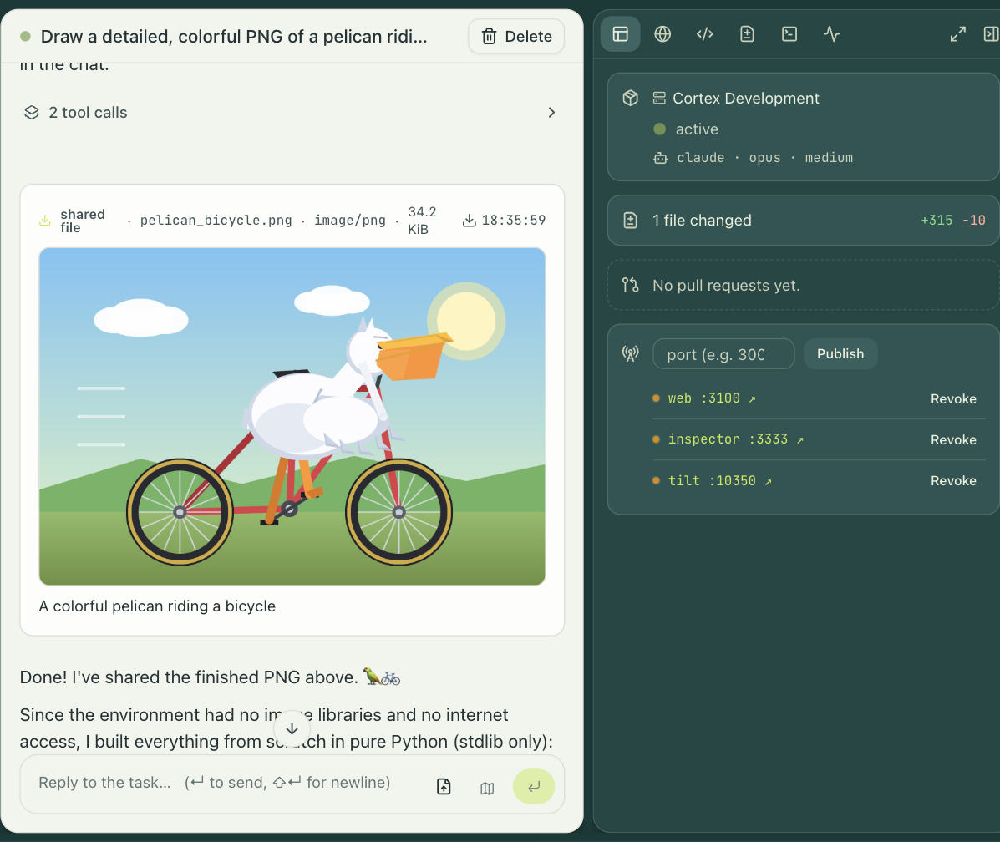

# engrams

engrams is a self-hosted orchestrator for AI coding agents. It runs each agent in its own [Firecracker](https://github.com/firecracker-microvm/firecracker) microVM, snapshots the VM when the agent goes idle, and restores it when the next prompt arrives.

A session is a plain OCI image plus an agent harness. You build the image with `docker build`, enable it once, and engrams boots it on a host in your own cloud, streams the transcript and tool calls to the dashboard, Slack, or the CLI, and snapshots the VM away when it goes quiet. Claude Code and Codex ship as harnesses. The pattern is the one behind hosted sandbox products like E2B, Modal Sandboxes, and Ramp's Inspect; engrams is the version you run yourself.



## Why should I use engrams?

- **It runs in your cloud.** One Terraform apply and two Helm releases bring it up on GKE or EKS, with GCS or S3 for blobs and your cloud's secret manager for credentials. No transcript, workspace, or key leaves your account.
- **Every session is a real virtual machine.** Isolation is KVM, enforced by hardware, not a container boundary. Outbound traffic from a session goes through a filtering proxy on the host, so an agent reaches only the hosts you allow.
- **Idle sessions cost nothing to keep.** When an agent stops talking, engrams snapshots the VM's memory and disk into content-addressed chunks and destroys the VM. The next prompt restores it: under 100 ms on the same host, one to two seconds on another host, and under a second from cold with no pre-warming.
- **Storage is deduplicated by construction.** Chunks are keyed by their hash, so a base image is stored once no matter how many sessions use it. A thousand sessions of a 4 GiB image take about 100 GiB, not 4 TiB.
- **Your image stays yours.** The agent runtime, the in-guest daemon, and the tools are staged by the host and mounted into the VM at boot. The image contract is any Linux image with `/bin/sh`.
- **It is a product, not a library.** A dashboard, tasks and profiles, a CLI, 24 built-in connectors, and automations: trigger-driven pipelines of agent runs that start from a schedule, a Slack thread, a pull request, or a webhook, with a durable record of every step. Pull request review and Slack threads ship as automations you enable.

## What engrams is not

- **engrams is not a hosted service.** You run it. If you want someone else to run the sandboxes, E2B and Modal do that well.
- **engrams is not a development environment for people.** Sessions exist for agents. You can open a shell or an IDE into one, but if you want workspaces for engineers at their editors, look at Coder.
- **engrams is not a container runner.** Production isolation is Firecracker on Linux with KVM, and there is no container mode. A macOS backend on Apple Virtualization exists for development only.
- **engrams is not a model provider.** You bring an Anthropic or OpenAI key, or point it at a router such as OpenRouter.
- **engrams is not finished.** It is a 0.x project that runs one company's production. Wire formats and APIs change, and it carries a fork of Firecracker that is rebased on upstream daily.

## Quick start

This section runs the whole stack on one machine for a first look. It is not a production shape. On an Apple Silicon Mac the sessions run under Apple's Virtualization framework; on a Linux machine with `/dev/kvm` they run under Firecracker; anywhere else they run as plain subprocesses with no isolation.

If you have Nix, `nix develop` gives you the pinned toolchain and you can skip the next block. Without Nix, on macOS:

```bash
# Rust per rust-toolchain.toml (https://rustup.rs), then:
rustup target add aarch64-unknown-linux-musl
brew install just tilt-dev/tap/tilt jq squashfs protobuf pkg-config openssl node pnpm bun
brew install FiloSottile/musl-cross/musl-cross --with-aarch64
# Docker Desktop, OrbStack, or Colima for the registry and Postgres containers.
```

On Linux you need the same Rust toolchain, Docker, `just`, `tilt`, `jq`, and `bun`.

Then, from the repo root:

```bash
just bootstrap     # writes a local master key to .env (once)
just pull-kernel   # fetches the guest kernel for this machine's backend (once)
just dev           # starts everything under Tilt
```

Tilt's status page is at http://localhost:10350 and the dashboard is at http://localhost:5173. Open the dashboard and create an account; registration is open in the dev stack. In a second terminal, bake and enable the demo image:

```bash
just bake-demo-enable
```

This builds the image in `deploy/demo/`, pushes it to the local registry as `localhost:5001/demo:warm-1`, enables it, and waits while engrams captures its base snapshot. That capture takes a minute or two the first time.

The agent needs a model key. In the dashboard, open Settings and either connect your Claude Code token for interactive sessions or add an org secret named `ANTHROPIC_API_KEY` for sessions started from the CLI and other automations.

Now build the CLI and start a session against the demo image:

```bash
(cd cli && bun install && bun run build)      # -> cli/dist/engrams
export ENGRAMS_URL=http://localhost:8787
export ENGRAMS_API_KEY=$(cat var/dev-api-key)  # the admin key `just dev` seeds

SID=$(cli/dist/engrams session create \
  --image localhost:5001/demo:warm-1 \
  --harness claude \
  --prompt "List /workspace and describe what you find.")
cli/dist/engrams session logs "$SID"
```

The log shows the agent's messages and tool calls as they happen. The same session is now in the dashboard. Leave it alone for a few minutes and it snapshots and stops; send another prompt with `engrams session prompt "$SID" "..."` and it resumes where it left off.

## Deploy to production

Production is a Kubernetes cluster with two Helm releases: the control plane (coordinator, orchestrator, web) and the Firecracker host fleet on a dedicated node pool with nested virtualization. Terraform quickstarts create the cluster, database, buckets, and secret shells for each cloud. Follow [`docs/deploy-gcp.md`](docs/deploy-gcp.md) or [`docs/deploy-aws.md`](docs/deploy-aws.md), and read [`docs/deploy.md`](docs/deploy.md) for the topology and the configuration reference.

## How it works

```
   dashboard · CLI · Slack · webhooks
                 │
        ┌────────▼────────┐        ┌─────────────────┐
        │   orchestrator  │───────▶│   coordinator   │────▶ Postgres
        │  auth · tasks · │        │ scheduler · idle│
        │  integrations   │        │ eviction · events│
        └─────────────────┘        └────────┬────────┘
                                            │  hosts dial in
                     ┌──────────────────────┼──────────────────────┐
              ┌──────▼──────┐        ┌──────▼──────┐        ┌──────▼──────┐
              │  host agent │        │  host agent │        │     ...     │
              │ ┌────┐┌────┐│        │ ┌────┐┌────┐│        │             │
              │ │ VM ││ VM ││        │ │ VM ││ VM ││        │             │
              │ └────┘└────┘│        │ └────┘└────┘│        │             │
              └──────┬──────┘        └──────┬──────┘        └─────────────┘
                     └──────────────┬───────┘
                          blob store (GCS · S3 · local)
                     image chunks · memory chunks · snapshots
```

The **orchestrator** is the product surface. It owns users and API keys, tasks and profiles, the Slack and GitHub integrations, and the Connect RPC API the dashboard and CLI call. The **coordinator** is a stateless service in front of Postgres that schedules sessions onto hosts, evicts idle ones, and fans out session events. Hosts never need an inbound port: each **host agent** dials the coordinator, registers its capacity, and runs the VMs. Inside every VM a small **in-guest daemon** starts the harness, runs commands, and moves files.

Storage is the part that makes the rest cheap. Disk and memory state live as hash-keyed immutable chunks in a blob store, with versioned manifests pointing at them. A base image is materialized into chunks once when you enable it. Sessions read those chunks on demand through an NBD device and page memory in lazily with `userfaultfd`, and a snapshot writes only the chunks that changed. Restoring on a different host is a matter of fetching the delta.

[`DESIGN.md`](DESIGN.md) has the full design and [`docs/architecture.md`](docs/architecture.md) the component and wire detail.

## Documentation

- [`docs/deploy.md`](docs/deploy.md), [`docs/deploy-gcp.md`](docs/deploy-gcp.md), [`docs/deploy-aws.md`](docs/deploy-aws.md): production deployment.
- [`docs/images.md`](docs/images.md): building session images and enabling them.
- [`docs/warm-hooks.md`](docs/warm-hooks.md): running a command once at enable time so sessions start warm.
- [`docs/telemetry.md`](docs/telemetry.md): OpenTelemetry spans for every model call and tool call.
- [`cli/README.md`](cli/README.md): the `engrams` CLI.

## Contributing

[`AGENTS.md`](AGENTS.md) is the guide for working in this repo: the build, the test lanes, and the conventions. `just check` runs the Rust gate before a pull request. The Firecracker fork's daily rebase is tracked at [](https://github.com/cortexapps/engrams/actions/workflows/rebase-fc-fork.yml); red means a rebase conflict needs a hand, per [`docs/runbooks/firecracker-fork.md`](docs/runbooks/firecracker-fork.md).

## License

Copyright (C) 2026 Cortex Applications, Inc.

engrams is free software under the GNU Affero General Public License v3.0. See [`LICENSE`](LICENSE).

The crates a custom harness links (`engram-harness-sdk`, `engram-harness-proto`, `engram-transport`, `engram-ids`) are Apache-2.0, so your harness does not take on AGPL terms. Each of those crates carries its own `LICENSE`.
