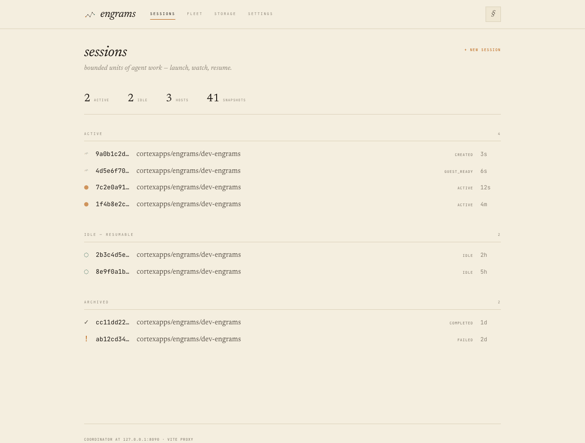
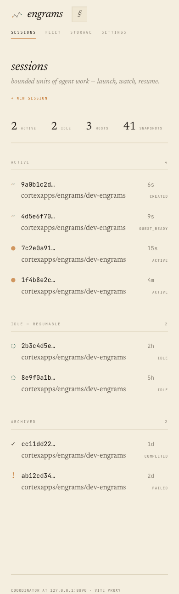
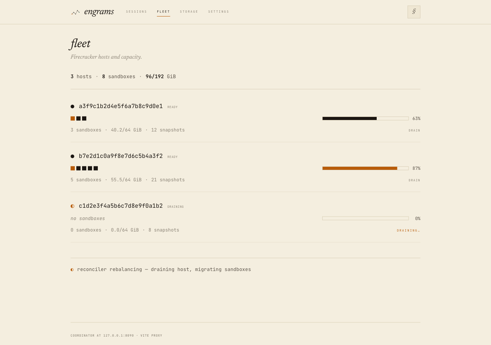
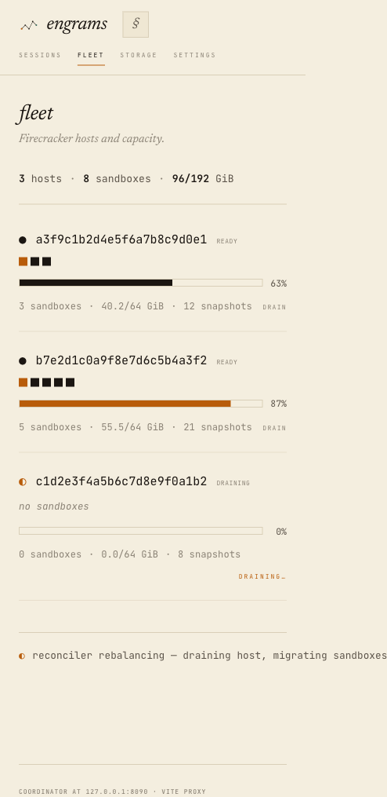
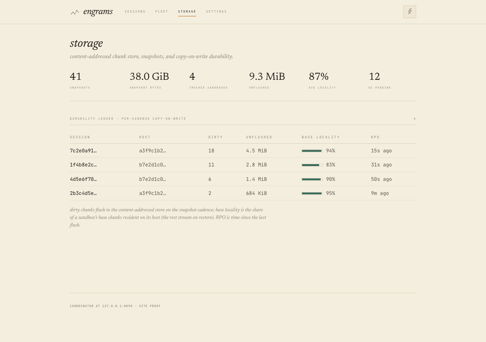
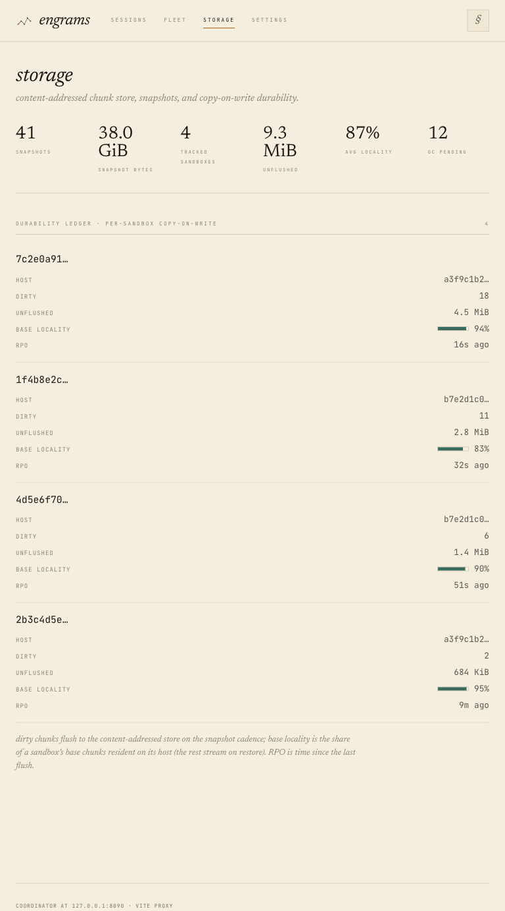

# ADR 0029: Four-surface web IA + brand identity (the "engram trace" mark)

Status: 2026-06-02 — **Accepted.** Implemented on `redesign/four-surface-ia`;
web `tsc`/`vitest`/`vite build` green, `cargo nextest`/clippy green for the new
coordinator endpoint, and all surfaces visually verified at three widths
(screenshots below). The masthead mark is the **static** canonical logo; the
growing-trace animation is reserved for loaders (per review).

## Context

The dashboard (`web/`) grew up as a single do-everything **Overview** page. It
served two audiences at once — the *driver* (launching, watching, resuming
sessions) and the *operator* (running the Firecracker fleet) — and the
copy-on-write / chunk telemetry had no real home: it was bolted onto a host row
as a `▸ cow state` toggle. The app also had **no brand**: a plain serif
"engrams" H1 and a "polling every second · HH:MM:SS" status line.

Claude Design delivered a high-fidelity handoff (a runnable HTML/Babel
prototype + the full logomark asset set) proposing a re-architecture into **four
surfaces on a persistent nav spine**, plus a brand identity. The prototype was a
*visual reference* authored against the repo's existing `theme.css` tokens — not
code to copy. This ADR recreates it in the real stack (React 19 + Vite +
Tailwind v4 + react-router 7 + @tanstack/react-query + framer-motion) and fixes
two known bugs from the live app.

It also carried two bugs we fix here first:

- **`WARM · NaN`** — the warm pool was removed from the backend; the real
  `HostView` no longer sends `warm_pool_available`, but `types.ts` still
  declared it, so `VitalSigns` summed `undefined`.
- **Wrong serif weight** — `main.tsx` imported Newsreader on the `opsz`
  (optical-size) axis, which Fontsource pins to `font-weight: 400`. Every serif
  element asked for at another weight (`.smallcaps` = 500, bold headings) fell
  down the stack to a generic serif.

## Decision

### Information architecture — four surfaces on a nav spine

A persistent, sticky **nav spine** replaces the per-page headers:

```
[mark] engrams   Sessions · Fleet · Storage · Settings        [§]
                 ↳ a3f9c1b2…   (sub-crumb when drilled into a session)
```

| Path | Surface | Replaces |
|---|---|---|
| `/` | **Sessions** (default) | Overview's session manifest + new-session |
| `/sessions/:id` | Session detail | `SessionDetail` (drills under Sessions) |
| `/fleet` | **Fleet** | Overview's `HostManifest` |
| `/storage` | **Storage** | the `CowState` host toggle (now a full page) |
| `/settings/*` | **Settings** | unchanged |

- Tabs are mono small-caps labels with a 1px **amber** underline on the active
  route — never pills. The `§` `UserChip` moves from the fixed corner into the
  spine's right slot. `/sessions/:id` is a child of Sessions: the spine keeps
  the Sessions tab active and shows a `↳ <short id>` sub-crumb (replacing the
  old `← back` link).

### Surfaces

- **Sessions** — a one-line **vital strip** (`active · idle · hosts ·
  snapshots`) demoting the old big stat-figures, then the manifest grouped by
  lifecycle (**ACTIVE** pinned → **IDLE — RESUMABLE** → **ARCHIVED**) with
  per-group counts. `NewSessionForm` is revealed behind a `+ new session`
  action.
- **Fleet** — hosts as ruled **strata**: sandbox cells (amber = backing an
  Active session, joined via `session.host_id`), a capacity bar (amber ≥80%), a
  rollup line, a `drain` control (optimistic mutation → the real
  `POST /hosts/:id/drain`), and a reconciler note derived from whether any host
  is draining. We ship **strata only** (the prototype's table-view toggle is
  not shipped).
- **Storage** — fleet-wide chunk/durability rollups + a per-sandbox
  **durability ledger** (`session · host · dirty · unflushed · base locality ·
  rpo`, verdigris locality bar, RPO amber ≤10s). Backed by a **new real
  endpoint** (below).
- **Settings** — unchanged.

### Storage data — a real coordinator endpoint, no synthesized numbers

`GET /api/v1/storage/summary` (`api/storage.rs`) aggregates, in one call: the
per-sandbox COW ledger across **every** registered host — reusing the existing
1s-TTL `CowStateCache`, so the page's 4s poll never fans a host RPC per request
— plus two cheap Postgres counts (`snapshot_totals`, `count_gc_candidates`). A
host that fails its COW RPC is **skipped, not fatal**.

**Deliberately *not* surfaced: "chunks stored" + "dedup ratio".** Both require an
`O(objects)` walk of the content-addressed blob store (only the admin
`POST /chunk-gc/dry-run` does that today). Running it on a polled endpoint would
put diagnostic load on the workload's hot path — a non-starter under our
"telemetry must not gate the workload" / reliability constraints. The handoff
prototype synthesized those two cells; we drop them rather than fake them, and
keep every shown number real. A maintained chunk-count/dedup counter is left to
a future phase.

### Brand — the "engram trace" mark, animation reserved for loaders

The mark is a sparse memory trace on a graph-paper lattice (amber entry node =
"now", ink path, verdigris consolidated terminal). `EngramMark` renders it
declaratively (so it always paints) and can drive the growing-bolt strike
imperatively via the Web Animations API, honoring `prefers-reduced-motion`.

**Divergence from the handoff (per review):** the prototype's "mark as live
status" looped/pulsed the masthead mark on the poll tick. We instead keep the
**masthead mark static** — it's the brand identity, not a status light — and
reserve the trace animation **for loaders only**: the inline boot loaders that
replace a session row's status glyph while it's `created`/`pending`/
`guest_ready` (the `created→active` / resume case). Favicons (SVG + PNG + `.ico`
+ apple-touch-icon) ship from the logomark set.

### Responsive

Two breakpoints, faithful to the handoff:

- **≤768px** — host strata stack (cells over a full-width capacity bar); the
  durability ledger flips columns → label/value records (header hidden,
  `::before { content: attr(data-label) }`).
- **≤600px** — the nav spine wraps (brand + § on top, tabs on their own
  scrollable row); surface heads stack; vital strip + fleet rollup wrap; session
  rows go two-line (glyph/id/age over image/status); storage rollups go 2-up.

The record-flip needs `content: attr(data-label)`, which Tailwind utilities
can't express, so the ported component classes + the responsive block live in
`theme.css` and the surfaces are className-driven.

The Lab Notebook language is preserved throughout: square corners (radius 0),
hairline 1px rules, flat surfaces, amber = "now" / verdigris = "archived /
durable", mono small-caps labels.

## Screenshots

Captured against the real app (Vite) with representative mocked API data, at
desktop (1280) / tablet (768) / phone (390).

### Sessions



### Fleet



### Storage



## Consequences

- The machine gets its own surfaces; COW state is first-class. The driver's
  home is uncluttered.
- The Storage page is honest about what the backend can cheaply serve; two
  prototype cells are intentionally absent (documented above) until a counter
  exists.
- `MetadataStore` gains two cheap aggregate methods (`snapshot_totals`,
  `count_gc_candidates`) with zero-defaults for non-PG mocks.
- Retired: `Overview`, `HostManifest`, the `HostCowState` toggle (and the dead
  `fetchHostCowState`/`useHostCowState`/`HostCowStateResponse`). Kept:
  `SessionCowState` on the detail page.

## Verification

- Web: `tsc -b`, `vitest run` (21 passing), `vite build` all green; the build
  bundles the Newsreader `wght` `.woff2` (font fix). Live devtools check —
  `document.fonts.check('500 24px "Newsreader Variable"') === true`, and **no
  `NaN`** anywhere in the body.
- Coordinator: `cargo nextest run` includes the new
  `storage_summary_zeros_on_empty_fleet` integration test (empty fleet → a
  well-formed all-zero shape, never `NaN`/null); it runs under CI's
  `cargo nextest run --workspace`. `cargo clippy -p engram-coordinator` clean.

## Commit chain

1. `fix(web): vendor Newsreader on the wght axis + drop dead WARM·NaN stat`
2. `feat(web): four-surface IA — nav spine, EngramMark, Sessions + Fleet`
3. `feat(coord,web): Storage surface + GET /api/v1/storage/summary`
4. `feat(web): ship favicons + responsive breakpoints`
5. `refine(web): masthead is the static logo; animation is loader-only`
