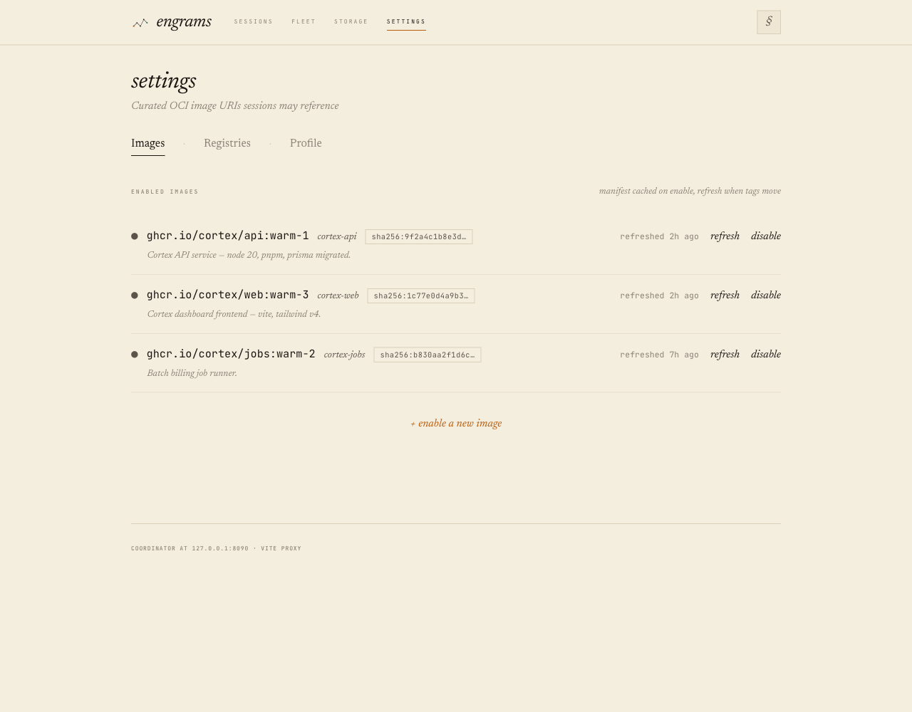
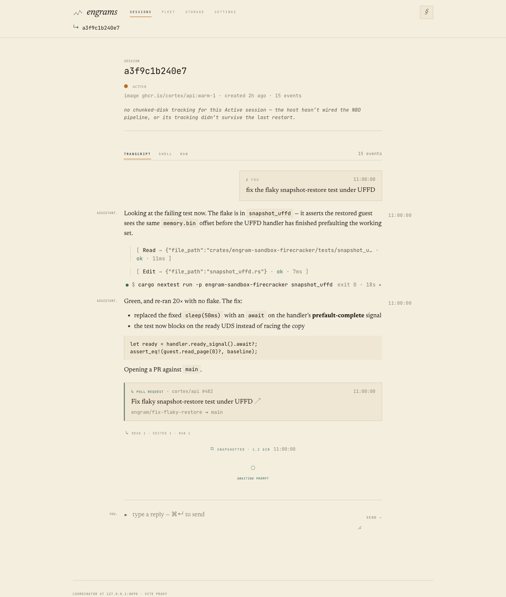
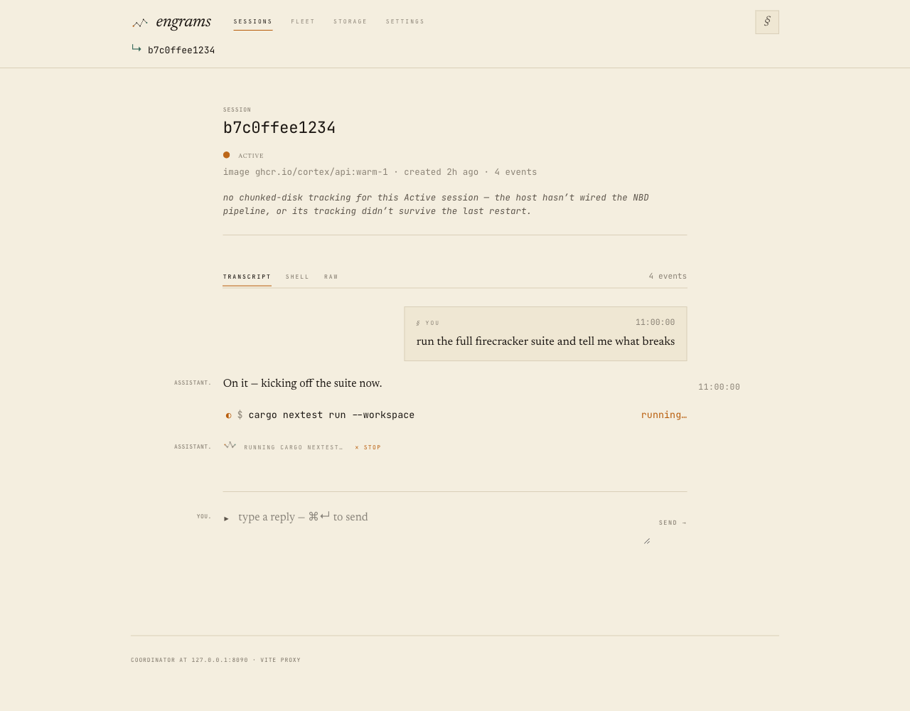

# ADR 0030: Session conversation redesign + operator interrupt

Status: 2026-06-02 — **Proposed.** Authored before code (the ADR-bookend
convention). Builds on the four-surface IA (ADR 0029). Work lands on
`worktree-adr-0030-session-conversation-redesign` as a single big-bang PR that
**directly replaces** the old surfaces — no feature-flag gating (engrams has 0
users; one-path code over scaffolding).

**Verification so far:** web `tsc -b` + `vitest` (39 tests, incl. the new
transcript/interrupt coverage) + `vite build` green; workspace `cargo fmt`,
`cargo clippy --all-targets -D warnings`, `cargo hakari verify`, and the new
`run_interrupted` from_harness + harness-proto round-trip/kind tests green;
all three surfaces visually verified against the real app (screenshots below).
**Still pending:** the harness-claude SIGINT path is `cfg(target_os="linux")`
(invisible to macOS clippy) and the operator-interrupt round-trip both need
**dev-vm validation against the baked `claude`** before this flips to
**Accepted**.

## Context

ADR 0029 re-architected the dashboard into four surfaces on a nav spine. Two
things it explicitly left untouched are now the product's weak spots, and Claude
Design delivered a focused follow-up handoff (`session_redesign_handoff/`) — a
runnable HTML/Babel prototype authored against the repo's `theme.css` tokens — to
fix them:

1. **The session transcript** (`/sessions/:id`) is thin: it renders messages,
   tool-call brackets, run boundaries, PRs and artifacts, but **drops** the
   `exec_*` / `stdout` / `stderr` / `snapshot_taken` / `resumed` events on the
   floor (`Transcript.tsx:341-345`), renders assistant text as **plain
   pre-wrap** (no Markdown), gives the human's prompt no distinct turn, has no
   run receipts, no context-aware waiting state, and **no way to stop a runaway
   agent**. The tool-call expand/collapse also animates poorly (see below).

2. **Settings** (`web/src/pages/Settings.tsx`) never picked up the 0029 nav-spine
   layout — it still renders the old narrow `book` column and a big
   `engrams › settings` breadcrumb-`h1`, so tabbing into it from the spine
   visibly shifts the content's left edge and reads as a different layout era.

The prototype is a **visual + interaction reference, not code to copy**. As with
0029 we recreate it in the real stack (React 19 + Vite + Tailwind v4 +
react-router 7 + @tanstack/react-query + framer-motion) against the real store,
SSE stream, and coordinator/agentd APIs. The Lab Notebook language is preserved
throughout: square corners, hairline rules, flat surfaces, amber = "now" /
verdigris = "archived / durable", mono small-caps labels — **no rounded chat
bubbles, no new hues.**

### A handoff premise that does not match our architecture

The handoff's interrupt section (#1f) prescribes the **Claude Agent SDK's
`query.interrupt()`** as the mechanism. That assumes a long-lived in-process
`query` object — i.e. a Node/Python harness built on `@anthropic-ai/claude-agent-sdk`.
**Our harness is none of that.** `engram-harness-claude` is a Rust process that
spawns the **`claude` CLI** (`claude --print --output-format stream-json
--verbose --dangerously-skip-permissions [--resume <id>] "<prompt>"`) **once per
prompt**, parses JSONL on stdout, and waits for the child to exit
(`main.rs:407-540`). There is no long-lived query object; conversation
continuity rides entirely on **disk** — Claude's session id is persisted to
`/workspace/.engram/claude-session-id` and replayed via `--resume`.

We researched the alternatives and verified the chosen one empirically (below).
The net: `query.interrupt()` doesn't exist for us, and adopting it would
*regress* the durability model that suspend/resume/evac depends on. We implement
interrupt as a **signal to the disposable per-prompt child**, which the spike
proved is clean and resumable.

## Decision

### 1 · Settings alignment (`web/src/pages/Settings.tsx`)

Make Settings visually continuous with the live Fleet/Storage/Sessions surfaces:

- `<main className="book py-12 relative">` → `<main className="book-wide surface">`
  so the content's left edge lines up with the nav spine and the other surfaces.
- **Drop** the `engrams › settings` breadcrumb-`h1` `Header` (the spine already
  provides home + location). Replace it with the **same header the shipped
  siblings use** — `surface-head` + big italic `surface-title` "settings" +
  `surface-sub` carrying the **per-tab hint** (Images / Registries / Profile),
  which already exists in the `TABS` array.

  > **Divergence from the handoff:** the README asks for a slim mono small-caps
  > *eyebrow* (`settings · <hint>`), "like the other surfaces' eyebrows." But the
  > four-surface IA that actually shipped in 0029 uses big italic `surface-title`s,
  > **not** eyebrows — the prototype diverged from the live app. Since the stated
  > goal is continuity *with the live siblings*, we match `surface-title` (decided
  > with the user). If 0029's surfaces are ever re-styled to eyebrows, Settings
  > follows then.

- Keep the **Images / Registries / Profile** `TabRow` + panels and routing
  exactly as-is. Keep image URIs `white-space: nowrap` (they're identifiers) now
  that the column is wider — add an `.image-uri` rule in `theme.css` if the panel
  doesn't already enforce it.

This is a small, self-contained, low-risk change; it ships first.

### 2 · Session conversation redesign (`web/src/components/Transcript.tsx` + friends)

All UI-only; uses events we already emit (except interrupt, §3). Modeled on
`prototype/transcript.jsx`. `buildBlocks` (`Transcript.tsx:217-350`) grows new
event handling; new presentational components join the existing
`ToolCall`/`RunBoundary`/`PullRequestCard`/`ArtifactCard` family.

**a. Right-aligned user turns.** Render the human's prompt as a contained,
**square, flat `paper-warm`** block, right-aligned, with a `§ you` label +
timestamp — **not** a rounded pill. Assistant/system stay as open prose,
full-width left, with the margin role-label.

> **Divergence grounded in our real stream:** the README says the prompt is
> carried by `run_started.prompt_summary` and warns against emitting a separate
> user message. In *our* stream the opposite is true: the claude harness emits
> `RunStarted { prompt_summary: None }` (`main.rs:628-631` — `system.init` has no
> prompt text), and the coordinator records the prompt as a **`role: User`
> `agent_message`** (`api/prompt.rs:73-87`). So we render the **user-role
> `agent_message`** as the `UserTurn`, and `run_started` (prompt_summary `None`)
> stays a plain run-boundary rule. There is exactly one carrier in our stream,
> so no double-render. (Plumbing the prompt into `RunStarted.prompt_summary` and
> dropping the user message was considered; it's a larger backend change for no
> visible gain and is out of scope.)

**b. Processes as first-class.** Render `exec_started` / `exec_completed` /
`stdout` / `stderr` (currently dropped) as a `Process` component:
`● $ <cmd> · exit 0 · 18s ▸` — exit-status dot (verdigris `●` exit 0 / amber `!`
non-zero / amber `◐` running), monospace command, duration, and an **expandable**
stdout/stderr block. Distinct from tool brackets: tools are `[ … ]`, processes
are `$ …`.

> Note: in our system `exec_*` events are **coordinator/operator-issued shell
> execs** (`/sessions/:id/exec`, `/shell`), *not* Claude's Bash tool calls —
> those arrive as `tool_call_*` and keep rendering as `[ … ]` brackets. Both now
> render; they're genuinely different things and read differently, which is
> correct.

**c. Durability rhythm.** Render `snapshot_taken` / `resumed` as a faint, centered
verdigris `DurabilityMarker`: `⌑ snapshotted · 1.2 GiB`, `⌑ resumed from
snapshot`. Ties the transcript to the snapshot/sleep/resume lifecycle — the
Engrams signature, currently invisible. (`evicted` is a candidate for the same
treatment; scoped to snapshot/resumed for now.)

**d. Run summaries.** Each run closes with a faint one-line receipt `RunSummary`:
`↳ read N · edited N · ran N · Ns`, tallied from that run's blocks (reads vs.
edits vs. execs vs. other tools, classified by `tool_name`; duration from
`run_started.at` → `run_completed.at`). Shows `interrupted` if the run was
stopped (§3).

**e. Context-aware waiting verb.** While a run is in-flight, show the **live
action** derived from the currently-open exec/tool — `running cargo check…`,
`reading snapshot_uffd.rs…`, `editing …` — falling back to a generic gerund
(thinking / working) only between turns. The verb sits on the harness-waiting
line beside a looping `EngramMark` (reuse the `mode="loop"` loader from 0029).
The trailing "busy" indicator is computed in `Transcript` exactly as the
prototype does (last non-terminal block open ⇒ busy).

**g. Markdown for final assistant output.** Render **completed** assistant/system
messages as Markdown via **`react-markdown` + `remark-gfm`**, with components
mapped to in-system `.md-*` classes (mono code, square bullets, hairline-boxed
inline code, verdigris-ruled code blocks — ported from the prototype's
`dashboard.css` into `theme.css`). **User turns stay plain text.**

- **Sanitization:** we render **without `rehype-raw`**, so raw HTML in model
  output is treated as literal text, never injected — no `dangerouslySetInnerHTML`,
  no separate sanitizer needed. Links get `rel="noopener noreferrer" target="_blank"`.
- **Streaming rule:** the README says render plain text while streaming, Markdown
  on completion. Our `agent_message` is emitted **per-final-message** (the harness
  consolidates; proto comment, `engram-harness-proto/src/lib.rs:119-133`) — there
  is no token-level streaming today (`AgentMessageChunk` is a future variant). So
  every assistant message is already complete on arrival and renders as Markdown
  immediately; the "plain while streaming" path is a documented no-op until chunked
  streaming lands.

**Tool-call / process expand animation — match the mocks.** The prod `ToolCall`
feels sluggish because it wraps each call in `<motion.div layout>` (expanding one
tool springs-reflows the *entire* transcript list) and animates `height: 0 →
auto` over 250ms on top of a 350ms mount fade (`ToolCall.tsx:25-86`). The
prototype uses **plain static CSS** — the detail simply appears, with only fast
`--dur-fast` (180ms) *color* transitions and no layout reflow. We drop the
`layout` prop and the height/opacity expand animation on `ToolCall` (and the new
`Process`), matching the prototype's snappy reveal; keep entry motion minimal and
non-reflowing.

### 3 · Operator interrupt / stop (new capability — backend + UI)

Let the operator stop the harness mid-run while keeping the session alive.

**Mechanism (decided): signal the disposable per-prompt `claude` child.** A new
`POST /sessions/:id/interrupt` drives a new `HarnessCommand::Interrupt` to the
harness, which **SIGINTs the in-flight `claude` child**, emits a new
`HarnessEvent::RunInterrupted`, and **returns to its `Idle` await-loop** (it does
*not* exit). The next prompt — even after evac to a different host — just does
`claude --resume`.

This is the same kill-then-continue mechanic the existing `Shutdown`-mid-run and
`max_run_secs` paths already use (`main.rs:479,507,521-526`), with two
refinements the spike surfaced:

- Send **SIGINT**, not `tokio`'s `child.start_kill()` (which is **SIGKILL** —
  the existing code's "SIGTERM" comments are wrong). SIGINT lets Claude run its
  own graceful interrupt + persist. Keep SIGKILL only as a grace-timeout fallback.
- Detect the interrupted run by Claude's terminal `result.subtype =
  "error_during_execution"` if we want a cross-check; functionally, the harness
  already knows it sent the interrupt and emits `RunInterrupted` unconditionally.

#### Why not the Agent SDK / a stream-json control frame

Research (sources below) plus the constraint that **Firecracker VMs are
suspended/snapshotted (idle→resume) and evacuated across hosts**:

- **Python `claude-agent-sdk`** is the only SDK with a working `interrupt()`, and
  only via a **long-lived streaming `ClaudeSDKClient`**. The TS SDK's `query()`
  has no `interrupt()` (the V2 session API that had it was removed in v0.3.142).
- A long-lived in-memory query (SDK) **or** a long-lived `--input-format
  stream-json` subprocess freezes a **live HTTPS connection to Anthropic into the
  FC snapshot**. On resume after idle (wall-clock jump — see our clock-steering
  work) or after evac to a new host, that socket is dead and must be rebuilt —
  re-deriving the exact `spawn fresh claude --resume` model we already have. The
  long-lived model buys interrupt at the cost of the durability story, and means
  embedding a Node/Python runtime in a Rust harness.
- The CLI has **no shipped stdin interrupt control frame** (proposed, unshipped:
  claude-code#41665). The documented control protocol is `initialize` /
  `permission` / `mcp_message` only.

So the per-prompt-CLI + signal model is both the only one consistent with FC
suspend/resume/evac and the simplest. If claude-code#41665 ever ships, the signal
can be swapped for the frame **without touching the coord/SSE/UI wiring**.

#### Spike (verified on this machine, `claude` 2.1.160 — the `latest` channel the bake pulls)

Spiked in an isolated temp workspace, mirroring the harness flags:

| Trial | Interrupt point | Stopped on SIGINT alone? | Terminal signal | `--resume` after | Context retained |
|---|---|---|---|---|---|
| 1 | during a Bash tool call | yes (no SIGKILL) | `result.subtype = error_during_execution` | exit 0 | recalled the exact command |
| 3 | mid text-stream | yes (no SIGKILL) | `result.subtype = error_during_execution` | exit 0 | recalled the essay topic |

Claude also writes a `[Request interrupted by user]` turn into its session
`.jsonl` before exiting, and the session persists on disk and resumes cleanly.

#### Wiring (mirrors `send_prompt` end-to-end)

The `send_prompt` chain to mirror for `interrupt`:

```
POST /sessions/:id/prompt        api/prompt.rs:61
  → HostClient::send_prompt       host_registry.rs:784  (SandboxBackend)
  → gRPC to host-agent            grpc_server.rs:289
  → host-agent HostClient         host_client.rs:157
  → HarnessHub::send_prompt       harness.rs:330  → HarnessCommand::Prompt over vsock
```

New code, additive at each layer:

1. **`engram-harness-proto`** — add `HarnessCommand::Interrupt` and
   `HarnessEvent::RunInterrupted { run_id }` with `kind() = "run_interrupted"`.
   Extend the round-trip tests and the `event_kind_strings_are_stable` test
   (`lib.rs:626`).
2. **`engram-harness-claude`** — handle `HarnessCommand::Interrupt` in the
   `run_one_claude_prompt` `tokio::select!` (`main.rs:512`): SIGINT the child
   (`nix::sys::signal::kill(Pid, SIGINT)`), mark the run interrupted, break;
   then in `run_one_connection` emit `RunInterrupted` (instead of
   `RunCompleted{ok:false}`) followed by the mandatory `Idle`, and **continue the
   loop** (do not exit). `next_prompt` is already cleared after the run, so the
   interrupted prompt is not auto-re-run.
3. **Host hub** — `HarnessHub::interrupt(sandbox_id)` mirroring `shutdown`
   (`harness.rs:300`) / `send_prompt` (`harness.rs:330`).
4. **Host transport** — gRPC method + host-agent handler + `host_client.rs` impl
   + the `SandboxBackend`/`HostClient` trait method, mirroring `send_prompt`.
   (All the mock backends in `idle_evictor.rs`/`evacuation.rs` gain a trivial
   impl.)
5. **Coordinator** — `SessionEvent::HarnessRunInterrupted { run_id, at }`
   (`state.rs`), its `kind()` arm = `"run_interrupted"`, and a `from_harness`
   arm (`state.rs:176`). New `api/interrupt.rs` handler + route in `api/mod.rs`,
   mirroring `prompt.rs` (no `ensure_active` — interrupt only makes sense on a
   live sandbox; return 409 if not bound).
6. **Web** — `types.ts` `run_interrupted` variant; register it in `sse.ts`'s
   `kinds` list; `buildBlocks` maps it to an `interrupted` marker and closes the
   run's `RunSummary` as `interrupted`; a `✕ stop` control on the harness-waiting
   line calls a new `interruptSession(id)` in `api.ts`.

`session_events.kind` is free `TEXT` (new kinds like `file_shared` were added
without a migration); confirm no CHECK constraint during impl — expected none.

### No feature flags

Per our zero-users / clean-breaks ethos, the redesign **directly replaces** the
old surfaces — no flag gating, no parallel old/new code paths. The whole thing
lands as one PR.

## Phasing (commit order within the one PR)

1. **Settings alignment** — small, self-contained.
2. **Conversation a–e + g + tool/process animation fix** — UI-only, existing events.
3. **Interrupt** — proto + harness + host transport + coord endpoint/event + UI;
   verified against the baked `claude` on the dev-vm.

## Screenshots

Captured against the real Vite app at desktop (1280) with representative
mocked API data (route-intercepted fixtures, the same approach as 0029).

### Settings — aligned to the nav spine
The big italic `surface-title` + `surface-sub` header on the `book-wide`
measure; content left edge lines up with the spine and the other surfaces.


### Session transcript — the full redesign
Right-aligned `§ you` turn; assistant prose with inline code; `[ … ]` tool
brackets; the `● $ cargo nextest … · exit 0 · 18s ▸` process line; Markdown
(square bullets, **bold**, a verdigris-ruled fenced code block); the PR card;
the `↳ read 1 · edited 1 · ran 1` receipt; and the `⌑ snapshotted · 1.2 GiB`
durability marker.


### Operator interrupt — context verb + ✕ stop
An in-flight run: the `◐ $ cargo nextest run --workspace · running…` process
line, and the harness-waiting line showing the live context verb
(`running cargo nextest…`) beside the looping engram mark with the `✕ stop`
control.


## Consequences

- The transcript becomes a faithful operator view: processes, durability rhythm,
  run receipts, live waiting verb, real Markdown, and a stop control — none of
  which it had.
- Settings stops being a layout-era outlier.
- The harness gains a clean operator interrupt that **composes with
  suspend/resume/evac** because it lands the session in the ordinary post-run
  Idle state, with continuity on disk via `--resume`.
- New wire surface: one `HarnessCommand` + one `HarnessEvent` + one
  `SessionEvent` (`run_interrupted`) + one coord route; all additive.
- `react-markdown` + `remark-gfm` join `web/`'s deps.

## Verification (planned)

- **Web:** `tsc -b`, `vitest run`, `vite build` green. New `buildBlocks` unit
  tests for: user-turn from a `role:user` message; `exec_*`+`stdout` → one
  expandable `Process`; `snapshot_taken`/`resumed` markers; run-summary tallies +
  `interrupted`; context-verb derivation; Markdown rendering of a completed
  message incl. fenced code (and that raw HTML is inert). Visual check of Settings
  continuity and the snappy tool/process expand at desktop/tablet/phone.
- **Backend:** proto round-trip + `kind`-stability tests; coord
  `cargo nextest`/clippy green incl. a `from_harness` mapping test for
  `RunInterrupted → run_interrupted` and an `api/interrupt` handler test
  (409 when unbound). FC-gated harness test if one fits the existing harness test
  rig.
- **End-to-end on the dev-vm (against the baked `claude`):** start a long run,
  `POST /sessions/:id/interrupt`, confirm `run_interrupted` on the SSE stream, the
  transcript marker + `interrupted` receipt, and that a follow-up prompt
  **resumes the same conversation** (the spike's resumability, re-confirmed in the
  VM). Then confirm an idle→resume round-trip after an interrupt still works.

## Commit chain (planned)

1. `feat(web): Settings nav-spine alignment`
2. `feat(web): transcript v2 — user turns, processes, durability, run summaries, context verb, markdown; snappy tool/process expand`
3. `feat(proto,harness): HarnessCommand::Interrupt + HarnessEvent::RunInterrupted (SIGINT the per-prompt claude child)`
4. `feat(coord,host): POST /sessions/:id/interrupt end-to-end + run_interrupted event`
5. `feat(web): ✕ stop control + interrupted marker`

## Sources (interrupt research)

- Agent SDK Python reference — `interrupt()` / streaming mode:
  https://code.claude.com/docs/en/agent-sdk/python
- Streaming vs single mode: https://code.claude.com/docs/en/agent-sdk/streaming-vs-single-mode
- Headless docs: https://code.claude.com/docs/en/headless
- claude-code#41665 — stdin interrupt control message (proposed, unshipped):
  https://github.com/anthropics/claude-code/issues/41665
- claude-code#24594 — `--input-format stream-json` undocumented:
  https://github.com/anthropics/claude-code/issues/24594
- Reverse-engineered CLI control-protocol spec (no interrupt subtype):
  https://github.com/Roasbeef/claude-agent-sdk-go/blob/main/docs/cli-protocol.md
