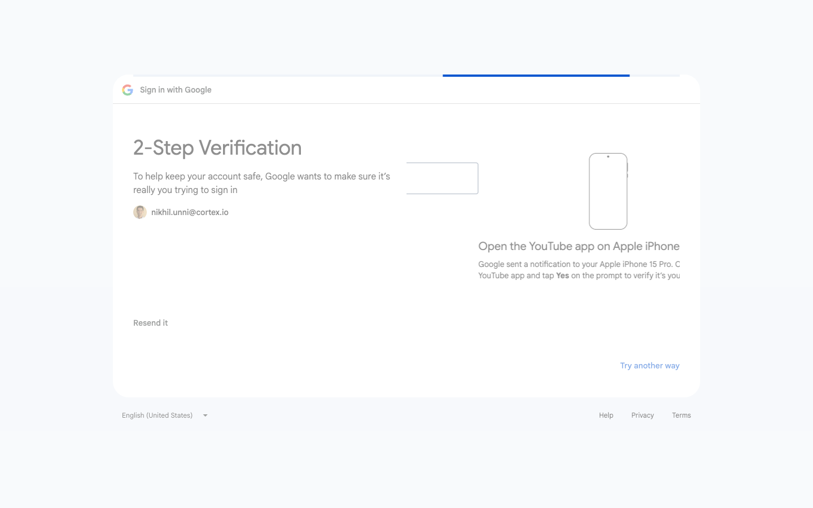
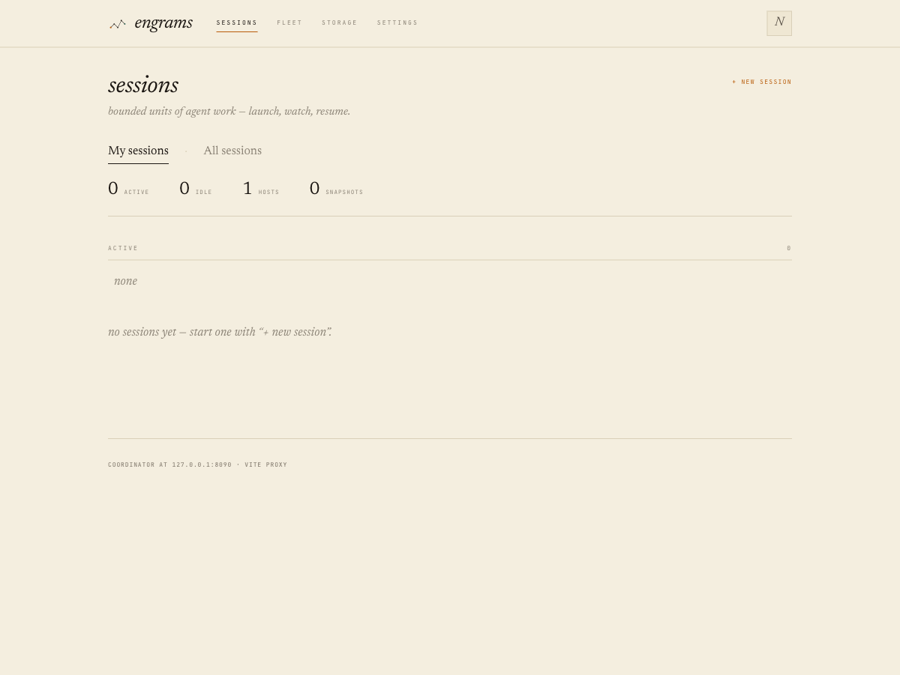
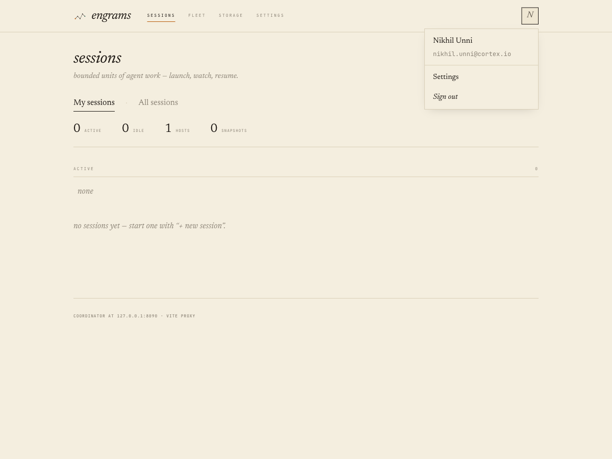
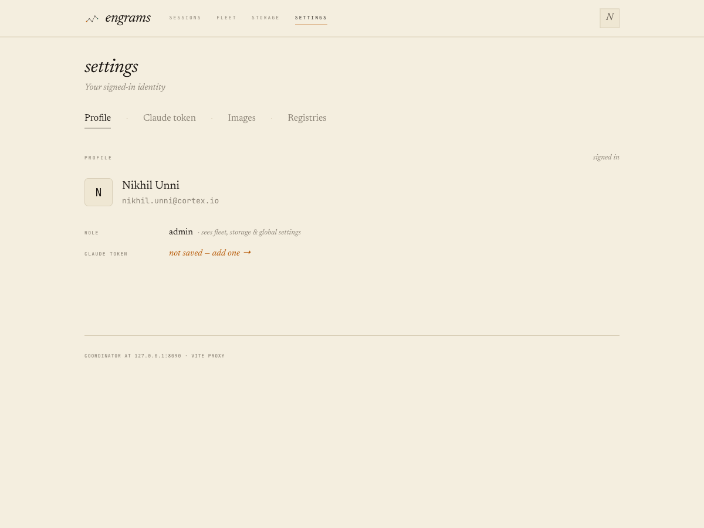
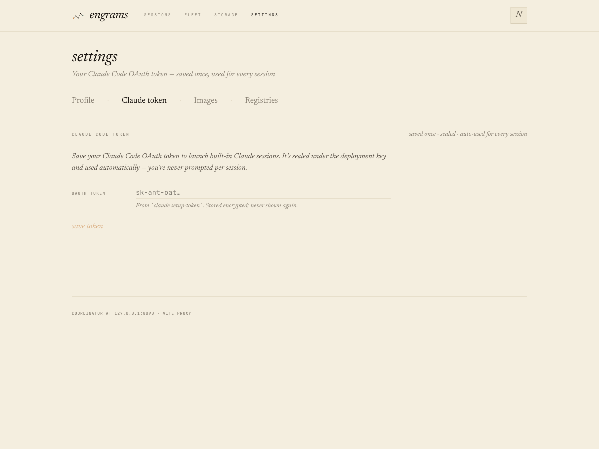

# ADR 0031: User authentication — SSO + per-user identity (SCIM-ready)

Status: 2026-06-02 — **Accepted.** Implemented on `worktree-adr-0031-user-auth`
(stacked on the in-flight ADR 0030 branch). `just check` green (fmt + clippy +
hakari + 914 workspace tests), live-PG `users_live_pg` green, web `tsc` +
`vitest` (41) + `vite build` green. Ships as one big-bang PR; PR base = the
0030 branch, re-target to `main` once 0030 merges.

Commit chain (oldest → newest): core user types + store traits → migrations
0046–0048 → engram-postgres impls (+live-PG tests) → engram-auth crate
(IdentityVerifier + chain + OIDC/forward-auth/bearer/synthetic) → coord
config/CLI + principal layer + router split + /me + /auth endpoints →
require_admin layer → session-create owner-stamp + token inject + git
attribution → owner-scoped sessions → session-bundles `[user]` gitconfig → web
api client + AuthProvider + profile menu + settings split + never-prompt token
gating + Sessions My/All views.

## Screenshots

Captured against a real **Google OIDC** login (`--auth-mode=oidc`,
`issuer=https://accounts.google.com`) on the local dev stack.

**SSO sign-in** — an unauthenticated request bounces to the IdP (Google here;
any OIDC issuer works):



**Authenticated dashboard (admin)** — real identity in the top-right chip, all
four surfaces, and the admin-only **My sessions / All sessions** scope toggle:



**Profile menu** — the chip resolves to the signed-in user (name + email) with
a working Sign out (replaces the old `§` placeholder):



**Settings — user vs admin split** — Profile + Claude token (everyone) alongside
Images + Registries (admin only); role + Claude-token status shown:



**My Claude Code token** — saved once, sealed under the KEK, auto-injected into
built-in-Claude sessions (never prompted per session):



## Context

engrams has no user identity. The coordinator authenticates every request against a
single deployment-wide bearer allowlist (`ENGRAM_AUTH_TOKENS`, checked in
`crates/engram-coordinator/src/api/auth.rs`); an empty list disables auth entirely so
`just dev` runs frictionlessly. The web app makes bare `fetch` calls with no
`Authorization` header, the top-right `UserChip` renders a `§` placeholder, and
`ProfilePanel` literally says "no identity yet." `sessions.user_id` exists as a nullable
free-form `TEXT` column but is never used for authorization. The Claude Code OAuth token
is pasted **per session** into `NewSessionForm` and rides the `secrets` dict; git commits
made inside a session carry no author identity.

This means: no roles (everyone who holds the bearer token sees everything), users
re-paste their Claude token on every session, the profile menu is inert, and commits
authored by a session are unattributable to the human who launched it.

We want real per-user identity — and it must be **identity-provider agnostic** (Cortex
uses Rippling, but nothing IdP-specific may be hardcoded) and **must not cripple local
dev** (`just dev` keeps working with zero auth configuration).

## Decision

### 1. Pluggable authentication behind a trait

Authentication is a new provider seam, expressed the same way as `MetadataStore` /
`SecretStore` / `CloudBackend` / `MasterKeyProvider`: a trait with one implementation per
mechanism, held as `Arc<dyn …>` and selected by config — **not** a `match` over modes.

A new framework-free crate `engram-auth` houses an `IdentityVerifier` trait and a
`VerifierChain`. Every implementation reduces a request to a `VerifiedEmail`, which is
JIT-upserted into a `Principal { user_id, email, role, active }` consumed uniformly by
handlers and extractors:

| Implementation | Used by | How it verifies |
|----------------|---------|-----------------|
| `OidcAuthenticator` | OSS deployments, no proxy | Authorization-Code + PKCE via the `openidconnect` crate; discovery (`.well-known`) + JWKS; ID-token nonce |
| `ForwardAuthVerifier` | behind an edge proxy (GCP IAP, Cloudflare Access, oauth2-proxy) | verifies a signed JWT forwarded by the proxy against a configured `(header, JWKS URL, issuer, audience, email claim)` |
| `ServiceBearer` | host-agent, CLI, machine callers | the **existing** `ENGRAM_AUTH_TOKENS` allowlist → admin-equivalent service principal |
| `SyntheticAdmin` | dev (no SSO configured) | returns one built-in admin principal for every request |

Per-request resolution order: **cookie session → ServiceBearer → ForwardAuth (if
configured) → SyntheticAdmin (only when no SSO is configured)**. First match wins. Adding
a new edge authenticator is a new `IdentityVerifier` impl, not a branch.

This is what makes engrams IdP-agnostic: the OSS core speaks standard OIDC against any
issuer (Rippling is just `issuer + client_id + client_secret`), and **GCP IAP is a
documented config preset** of the five `ForwardAuth` fields — not a Google code path — so
the same binary runs behind Cloudflare Access or oauth2-proxy unchanged.

### 2. Authentication ≠ provisioning; they reconcile on email

A deployment can authenticate via one system and provision via another (Cortex: login via
Google/IAP, directory via Rippling). The two axes join on the **email address**:

- **Authentication** (`IdentityVerifier`) proves *who is making this request*.
- **Provisioning** populates *who exists, their role, and their active state*.

This PR ships **JIT provisioning**: on first successful login the user row is upserted
from the verified email (role from a config bootstrap-admin allowlist, else `member`).
A future **SCIM 2.0 server** (RFC 7643/7644) is deferred but the schema is designed for
it now — `role_source` (`manual | scim | claim`), an `active` flag, and a `groups` notion.
When SCIM lands it becomes **authoritative with manual override**: a `manual` role_source
row is never clobbered by SCIM group sync. SCIM also brings deprovisioning that
authentication alone cannot — an inactive row is rejected even if the edge proxy still
authenticates the person.

### 3. Human sessions vs. machine tokens

Humans get an **opaque session token in an `HttpOnly; Secure; SameSite=Lax` cookie**,
backed by a `web_sessions` Postgres table (token hashed at rest). DB-backed (not a
browser-held JWT) so deprovision/logout = delete the row, with no JWT-expiry replay
window. The existing deployment bearer token stays for host-agent / CLI / internal calls;
coord auth resolves *either* a valid cookie *or* a service bearer.

**The browser no longer carries the deployment bearer.** Before 0031 the web app reached
coord behind a proxy-stamped `ENGRAM_AUTH_TOKENS` bearer; now human auth is purely
session-based — the session cookie (OIDC mode), the IAP/forward-auth assertion
(forward-auth mode), or nothing (dev synthetic). The web client sends `credentials:
'include'` and **no `Authorization` header**. `ENGRAM_AUTH_TOKENS` is retained solely for
machine callers on the `internal` router; the prod deploy's nginx no longer needs to stamp
a bearer for browser traffic.

### 4. Roles

Two roles: `admin` and `member`. Admins see Fleet / Storage / admin-Settings and the
operator endpoints (host drain, registries, enabled-images, user admin); members see
Sessions and their own profile. Enforcement is a coord `AdminOnly` extractor (the real
gate); the web only hides tabs (UX). Now: roles come from a config bootstrap-admin email
allowlist + manual promotion via `PATCH /admin/users/:id`. Later: SCIM groups.

### 4a. Sessions are private to their owner

A session belongs to the user who created it (`sessions.user_id`, now server-stamped
from the principal — §6). Visibility is scoped by that ownership:

- A **member** sees and can act on **only their own** sessions. The Sessions list is
  filtered to `user_id = principal`, and every per-session route (`GET /sessions/:id`,
  prompt, exec, shell, events, delete, resume) is gated by an ownership check — a member
  requesting another user's session id gets `404` (not `403`, to avoid confirming the id
  exists).
- An **admin** can view **their own** sessions or **all** sessions. The list endpoint
  takes a `scope = mine | all` query param; `all` requires admin. Per-session access is
  unrestricted for admins.

Enforcement is server-side (the real gate), keyed on the resolved `Principal` in the
coordinator's session handlers — this is an authorization rule, not a convenience.

**Product design of the Sessions surface (great, not just correct):**

- **Members get no scope UI at all** — just their list. No toggle hinting at other
  people's sessions, no tab that 403s, no flash of admin chrome during load.
- **Admins default to "My sessions,"** not the fleet-wide firehose. "All sessions" is an
  oversight mode they opt into via a segmented control (`My sessions | All sessions`) in
  the surface header, styled to the four-surface brand.
- **Owner attribution is the load-bearing element of the All view:** every row carries an
  owner chip (initial/avatar + email). In "My sessions" the owner is implicit — no
  self-chip clutter.
- **Two segments, not three.** `all` includes the admin's own (with owner labels); a
  separate `others` scope adds cognitive load for no real benefit.
- **Situational awareness:** live counts on the segments ("My sessions 3 / All 27"), an
  optional filter-by-owner in the All view for scale, and distinct empty states per scope
  ("No sessions yet" vs "No active sessions across the fleet").

### 5. Dev runs with a synthetic admin

When no SSO is configured (`AuthMode::None`), the verifier chain ends in `SyntheticAdmin`,
which returns one built-in admin principal for every request. `just dev` needs zero auth
setup, there is no login wall, and the dashboard renders the *real* authenticated
experience (profile menu, all tabs, token save) while exercising the actual authed code
paths. The dev committer email defaults to a configurable address.

### 6. Per-user Claude OAuth token — never prompt again

A new KEK-sealed `user_tokens` store (reusing `engram-crypto`'s `CredCipher` +
`MasterKeyProvider`, identical envelope shape to `session_secrets`). The user saves their
Claude Code OAuth token once on their profile. At session create, **only when the resolved
harness is `builtin = "claude"`**, the coordinator auto-injects the user's
`CLAUDE_CODE_OAUTH_TOKEN` into `session_env`. We never prompt per session. If the user has
no token saved and the image uses built-in Claude, the web "Create session" button routes
them to the token-save screen instead of creating. Custom harnesses and images that
declare their own `[secrets]` are untouched.

### 7. Git committer attribution

`ENGRAM_USER_EMAIL` / `ENGRAM_USER_NAME` (from the initiating user's profile) flow through
`session_env` into `render_gitconfig` (`engram-session-bundles`), which writes a `[user]`
block to `/etc/gitconfig`. The gitconfig write is decoupled from the forge-token gate so
attribution applies to every session, not just forge-enabled ones. The push credential
(GitHub App installation token) is independent of commit authorship; GitHub links the
commit to the human iff their email is verified on their GitHub account, degrading
gracefully otherwise.

### 8. Web IA: user settings split out from global

Today's "Settings" (images, registries) is really *admin/global* config. We split it:
**user settings** (profile + "My Claude Code OAuth token") reachable by everyone from the
profile menu, and **admin settings** (images, registries) admin-only. The `UserChip`
becomes a real profile menu (initial/avatar, email, working sign-out); its "Settings" link
targets *user* settings. `NavSpine` hides Fleet / Storage / admin-Settings for members.

## Rationale

- **Direct OIDC over a managed broker (WorkOS) or SAML.** OIDC via discovery is agnostic
  by construction, needs no extra infra (good OSS default), and a broker can still front
  it later with zero code change. SAML's XML/signature footguns and weaker Rust libraries
  aren't justified when Rippling speaks OIDC.
- **Trait seam over mode-switch.** Matches every other pluggable provider in the codebase;
  a new authenticator is an impl, and `ForwardAuth`-as-config keeps IAP from leaking a
  Google-shaped branch into the core.
- **JIT now, SCIM later.** SSO + login-time provisioning is the value most users want
  first; a compliant SCIM server is real work and can land authoritative-with-override on
  the schema we seed now.
- **DB-backed opaque cookie over browser JWT.** Clean, instant revocation — the property
  deprovisioning needs.

## Implications

- New crate `engram-auth` (+ workspace/hakari wiring); new `engram-core` `user` types and
  `UserStore` / `WebSessionStore` traits; Postgres impls; migrations `0046`–`0048`
  (free atop the 0030 base, which adds nothing past `0045`).
- Coordinator gains the verifier chain, a `resolve_principal` layer, `Principal` /
  `AdminOnly` extractors, an `api/mod.rs` split into a human-cookie group and an
  internal-bearer group (host routes must keep the bearer), and `/auth/*`, `/me`,
  `/me/claude-token`, `/admin/users` endpoints. `CreateSessionRequest` drops the
  client-supplied `user_id` (now server-stamped from the principal).
- `EnabledImageSummary` gains a `harness_builtin` field so the web can gate create on the
  built-in-Claude case reliably.
- Session list + per-session routes gain owner-scoping: members see only their own
  sessions (others' ids → 404); admins get a `scope = mine | all` switch (default `mine`).
  The Sessions web surface renders a `My sessions | All sessions` segmented control for
  admins only, with owner chips + counts in the All view; members see no scope UI.
- Risk: forgetting to keep host/internal routes on the bearer path would break the
  control plane; the router split is the mitigation. Cookie `Secure` must be config-gated
  off for http-localhost dev. OIDC state/PKCE/nonce must be validated to prevent CSRF.
- Deferred: SCIM 2.0 server; per-image `[secrets]` rendering for custom harnesses in the
  create form (needs the secrets schema on `EnabledImageSummary`).

## Appendix: deployment presets

All auth is config — these are flag/env sets, no code differences.

**Dev (default, zero setup):** no auth flags → `AuthMode::None` → synthetic
admin. `just dev` and the test harness run as one local admin; the dev
committer email is `--dev-default-email` (default `dev@engram.local`).

**OSS / direct OIDC (any IdP — Okta, Auth0, Rippling-OIDC, …):**

```
--auth-mode=oidc
--oidc-issuer=https://<issuer>            # ENGRAM_OIDC_ISSUER
--oidc-client-id=<id>                      # ENGRAM_OIDC_CLIENT_ID
--oidc-client-secret=<secret>              # ENGRAM_OIDC_CLIENT_SECRET
--oidc-redirect-url=https://<host>/api/v1/auth/callback
--bootstrap-admin=you@corp.com             # comma-sep; promoted to admin on first login
--cookie-secure                            # prod (HTTPS)
```

**Behind GCP IAP (the Cortex internal deployment) — no double login:** IAP
already authenticated the user with Google; coord verifies its signed
assertion. This is a preset of the five generic forward-auth fields, not a
Google code path — Cloudflare Access / oauth2-proxy use the same flags with
their own values.

```
--auth-mode=forward-auth
--forward-auth-header=X-Goog-IAP-JWT-Assertion
--forward-auth-jwks-url=https://www.gstatic.com/iap/verify/public_key-jwk
--forward-auth-issuer=https://cloud.google.com/iap
--forward-auth-audience=/projects/<PROJECT_NUMBER>/global/backendServices/<BACKEND_ID>
--forward-auth-email-claim=email
--bootstrap-admin=you@cortex.io
--cookie-secure
```

Provisioning is independent of the login path and reconciles on email: today
JIT (the user row is upserted from the verified email on first request); when
the SCIM 2.0 server lands (deferred), Rippling provisions/deprovisions users +
groups, authoritative-with-manual-override.

This status section is updated between phases with divergences/pitfalls and was flipped to
**Accepted** with the commit chain when the work landed.
