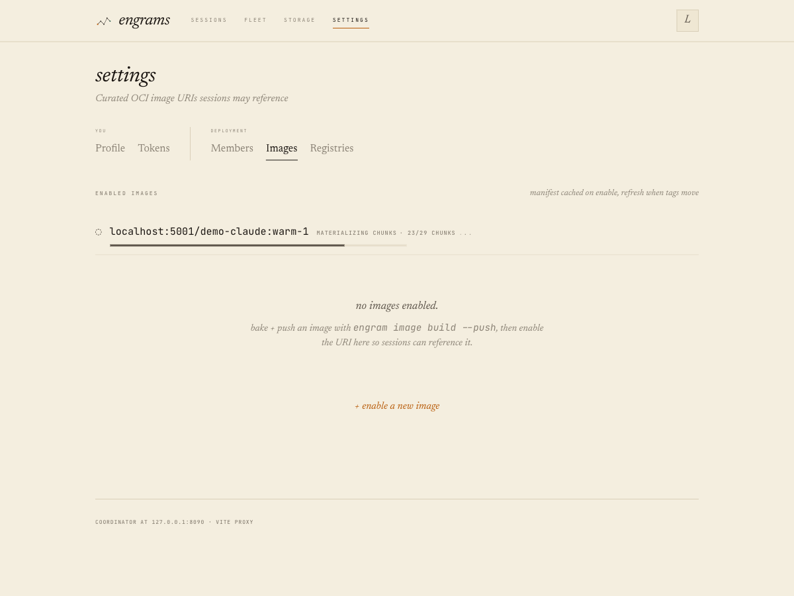
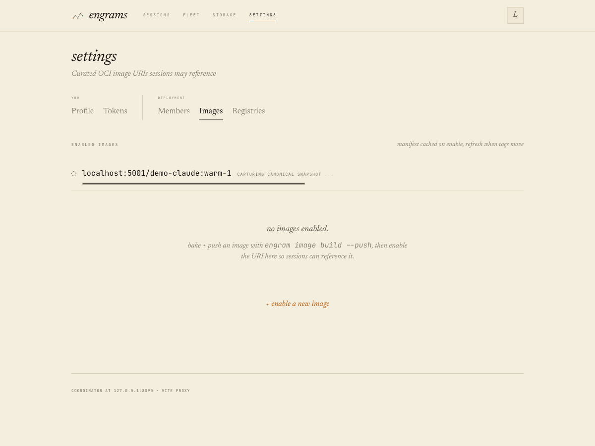
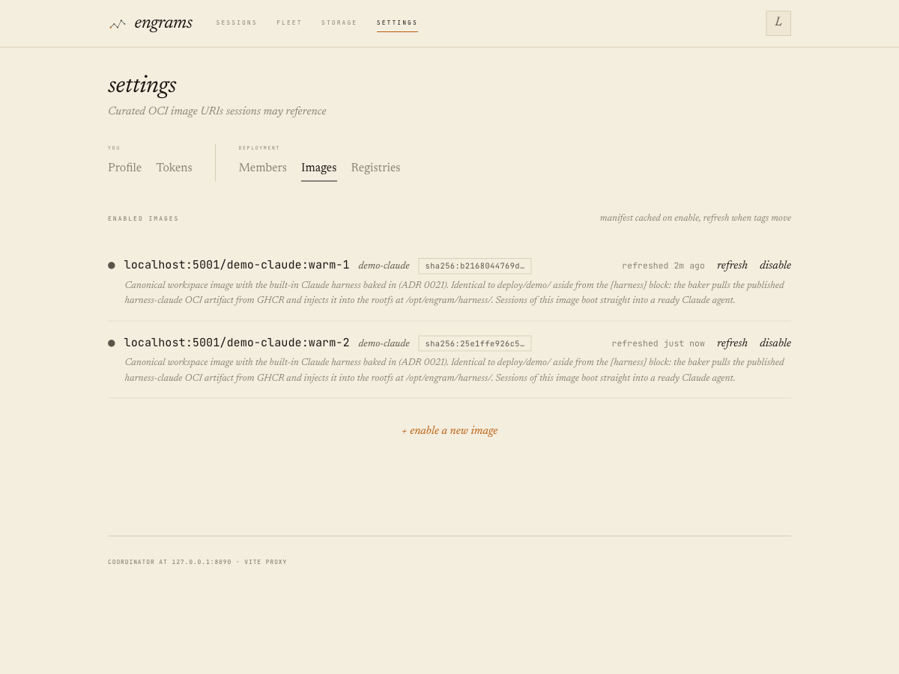

# ADR 0036: Per-chunk OCI image artifacts + async enable pipeline

Status: 2026-06-03 — **Accepted.** Implemented (commit chain below)
and validated end-to-end locally on the `just dev` stack (macOS/VZ,
real docker bake, real registry):

- **Delta push**: a full re-bake of unchanged source under a new tag
  produced the same content-derived manifest (`4a1e82a0…@v1`) and
  pushed `0/29` chunks (`pushed=0 skipped=29`).
- **Async enable**: `pending → materializing 29/29 → capturing →
  ready` with live progress in both the CLI and the web panel.
- **Content-keyed reuse**: enabling the second tag took ~2 s with
  zero capture VMs; both rows share one `base_snapshot_id`, and a
  session created against the reused-snapshot tag boots and execs.





Remaining prod watch (post-merge, non-blocking): first GHCR delta
bake + async enable of dev-engrams through the job API.

Implementation (one commit per phase, this branch):

- `d9df23d` ADR authored (Proposed)
- `8db73dc` P1: per-chunk OCI artifacts — delta push/pull, monolithic
  blob + Range-GET path + parent-bootstrap machinery deleted,
  shared-client token reuse, `blob_exists` HEAD probe,
  `per_chunk_roundtrip` wire test
- `e50f937` P2: `enable_jobs` state machine (migration 0052 — 0050/
  0051 were taken by ADRs 0034/0035 mid-flight), enable_scanner,
  202 + progress API, real web progress bar, CLI polling,
  `enable_jobs_live_pg`
- `de6f479` P3: deterministic ext4 (`-U`/`hash_seed`/
  `SOURCE_DATE_EPOCH`, each verified load-bearing empirically),
  cross-tree determinism test
- `bf197ff` P4: content-derived `ManifestRef` + content-keyed
  base-snapshot reuse (`find_enabled_image_by_content`), live-PG
  lookup tests
- `ef3a09c` P4 e2e: moved-tag test — two tags, identical content,
  exactly one capture VM, shared `base_snapshot_id`

Divergences from the original proposal, found while implementing:

- **Migration renumbered 0050 → 0052**: ADR 0034 (idle-eviction state
  machine) and ADR 0035 (content-addressed bundle generations) merged
  to main mid-implementation and took 0050/0051; this branch rebased
  onto both.
- **P4 was nearly dropped, then un-dropped**: the first read of
  ADR 0035 suggested capture-skip would freeze bundle freshness
  (capture being the only bundle delivery path). Closer reading of
  `restore_in_jail` showed Invariant 2's `swap_aux_to_current`
  already delivers current bundles at session-create, making
  content-keyed reuse sound. Decision 4 documents the full
  reasoning so the next reader doesn't re-walk the same maze.
- **Docker-level determinism is the remaining delta-limiter**: the
  ext4 pack is deterministic *given the same rootfs tree*, but
  `docker build` on cache-less CI runners re-runs every layer and
  may embed timestamps. Cross-bake dedup ratios in prod therefore
  depend on adding buildx layer caching to the engrams-internal bake
  workflows (follow-up there, not here). Same-artifact re-enables
  (the moved-tag case) are unaffected — those are byte-identical by
  construction.

## Context: every image transfer is all-or-nothing, and both directions fail

A session image (~10 GB for `dev-engrams`) is chunked at bake time into
16 MiB sha256-addressed chunks — and then the chunks are concatenated back
into **one monolithic OCI blob** for transport through GHCR. That single
decision makes every transfer all-or-nothing, and both directions have now
failed in production-relevant ways:

**Push (bake).** `push_chunked_image` holds the whole blob as one `Vec<u8>`
(its own doc comment flagged the allocation as "leave for when bakes hit
memory pressure") and uploads it in a single session with no retry.
engrams-internal run `26896256662` (2026-06-03) died 8.5 minutes into that
upload with a connection-level error mid blob-session:

```
engram-cli: push: docker: oci chunked push: OCI distribution error:
error sending request for url (https://ghcr.io/v2/.../blobs/upload/d6a943a7-…)
```

One TCP hiccup discards the entire upload and fails the bake. The blob also
sits at GHCR's **10 GB per-layer ceiling** — the format dies outright the
day the image grows.

**Pull (enable).** `POST /api/v1/enabled-images` synchronously materializes
all ~625 chunks out of the blob via Range GETs. `fetch_blob_range`
constructs a **fresh oci-client per call**, so every chunk mints a new
bearer token from GHCR's token endpoint — ~1,250 requests per enable from
one pod IP, which trips GitHub's secondary rate limiting (429s). The retry
loop (5 × 200–800 ms, added in `32cb00e`) is blind to `Retry-After`, so
throttling burns retries (each minting another token) and fails the enable.
All of this — plus a capture-VM boot — runs inside one HTTP handler that
the external LB kills at ~30 s, hence the operator ritual of port-forward +
`curl.sh`. The enable path has already whipsawed once: the original
whole-blob pull OOM-killed the 2 GiB coord pod on a 7.6 GiB image
(`51af4a0`), and the fix over-corrected to per-chunk requests without
fixing token reuse.

**Dedup never fires.** Chunks are content-addressed and the materializer
skips chunks already in BlobStorage — but `mke2fs` runs with a random
filesystem UUID, a random htree hash seed, and uncontrolled mtimes, so a
rebake with 95% identical content produces ~100% new chunk hashes. Every
bake uploads ~10 GB; every enable downloads ~10 GB; the dedup machinery
(ADR 0008 Phase 4) exists but never engages across bakes.

## Decision

Adopt Docker's own model for the same problem, end to end:

1. **Per-chunk OCI blobs.** The artifact's chunk data becomes one OCI blob
   per 16 MiB chunk, where the OCI blob digest **is** the chunk hash
   (`sha256:<chunk-hash>` — our `ChunkHash` is already sha256 of the chunk
   bytes, so the registry digest space and the BlobStorage key space
   unify). The OCI manifest carries config + small layers (`manifest.toml`,
   `bundle.json`, `bootstrap.disk.json`) + ~625 chunk layer descriptors
   (~100 KB manifest; GHCR's cap is 4 MB). Bootstrap entries carry
   `blob_digest = Some("sha256:<chunk-hash>")`, `blob_offset = 0` — the
   schema (ADR 0008 Phase 4) already supports this; only the plumbing was
   monolithic.
   - Push: HEAD each digest, upload only missing chunks (16 MiB apiece,
     individually retryable, streamed from the local store — no giant
     allocation). The registry dedups blobs across tags, so a `warm-*` tag
     re-push re-references unchanged chunks instead of re-storing 10 GB.
   - Pull: full-blob GET per missing chunk by digest, one shared
     authenticated client per run (fixes the per-chunk token minting),
     retries honoring `Retry-After`.
   - The 10 GB layer ceiling becomes irrelevant forever.

2. **Async enable as a PG-backed job state machine** (the pattern of
   ADR 0034 / the evac resumer): `POST /api/v1/enabled-images` returns
   **202** with an `enable_jobs` row; a coordinator scanner drives
   `pending → materializing → capturing → ready | failed`, checkpointing
   `chunks_done/chunks_total` for real progress UX (the web UI currently
   *simulates* enable progress off wall-clock time). Jobs are claimed via
   a lease (`claimed_by/claimed_at` + atomic UPDATE), so multiple
   coordinators are safe and a crashed pod's job is re-claimed after lease
   expiry. Every step is idempotent (exists()-skip materialize,
   reuse-checked capture, upsert), so restart-resume is free. A 429 now
   degrades to a slower progress bar instead of a failed enable.

3. **Deterministic ext4 builds** so unchanged content reproduces identical
   chunk digests across bakes: `mke2fs -U <fixed> -E hash_seed=<fixed>`
   plus mtime normalization of the exported rootfs tree before packing.
   This is the keystone that turns 1 and the existing GCS dedup into
   *delta* transfers: a deps-unchanged rebake should push/pull tens of
   chunks, not 625.

   **Follow-up (the version floor + where the pin lives).** `mke2fs` only
   *honors* `SOURCE_DATE_EPOCH` from **e2fsprogs 1.47.1**; older builds
   (Ubuntu apt ≤ 1.47.0) silently stamp wall-clock times into the
   superblock and every inode, so the `-U`/`hash_seed` pin above is a
   no-op and re-bakes never byte-match — degrading the dedup this point
   exists for. Rather than make that a per-workflow CI concern,
   determinism is now a property of the **tool**: the OSS `cli-tools`
   artifact bundles a pinned static `mke2fs` (`flake.nix`
   `packages.mke2fs-static`, e2fsprogs ≥ 1.47.1) next to `engram-cli`,
   and the packer resolves a sibling `mke2fs` before `$PATH`
   (`ext4.rs::resolve_mke2fs`: `$ENGRAM_MKE2FS` → sibling → `$PATH`). So
   every consumer of the golden binaries — the reusable bake workflow,
   the engrams-internal bakes, downstream dogfood repos — gets a
   byte-deterministic bake with zero setup. The from-source bake +
   engrams' own packer test instead put the flake's dynamic `.#mke2fs`
   on `$PATH` (their nix store is present, so dynamic is fine).

4. **Base-snapshot capture reuse keyed on content.** The reuse check
   used to key on `(image_uri, OCI manifest digest)`, so the common
   prod case — a re-bake under a fresh `warm-<sha>` tag with
   byte-identical content — always re-captured: a new VM boot, a new
   snapshot lineage (memory snapshots are boot-nondeterministic and
   never dedup, hundreds of MB per capture), and a fleet-wide
   re-prefetch of the new chunks. Two changes make identical content
   *recognizable* and reusable:
   - The bake's disk `ManifestRef` is **content-derived**
     (`Manifest::content_ref`, sha256 over the chunk layout) instead
     of `Uuid::new_v4()` — a random id that polluted `bundle.json`
     and made even deterministic re-bakes look like new content at
     every layer above. (Snapshot manifests keep random ids; their
     content is nondeterministic per capture.)
   - The reuse check becomes content-keyed
     (`find_enabled_image_by_content`): any enabled image —
     soft-deleted included, its snapshot stays GC-pinned — with the
     same `disk_manifest` AND the same `manifest_toml` donates its
     base snapshot, and the enable job jumps straight to `ready`.
     The legacy URI+digest check remains only for harness-only
     images without a chunked disk.

   **Why reuse is sound despite bundle drives** (this was nearly a
   landmine): a base snapshot embeds a third input besides rootfs +
   manifest — the aux bundle generations (skills/playwright squashfs)
   staged on the capture host at that moment, which the coordinator
   can't see. Under ADR 0027 that made capture the only bundle
   delivery path, and skipping it would have frozen bundle freshness.
   ADR 0035's Invariant 2 dissolved this: session-create loads the
   snapshot paused and `patch_drive`s any stale-pinned aux drive to
   the host's **current** staged generation before resuming (resumes
   keep their pins — live guests hold fds). The embedded generation
   is only the durable fallback, so a reused snapshot is equivalent
   to a fresh capture for every session created from it. A
   manifest.toml change (env, resources, bundle opt-ins) still forces
   a fresh capture by key construction.

Zero users → clean break: the monolithic `chunks.disk.v1` layer, the
`disk_chunks_blob` fields, and the Range-GET materialize path are deleted,
not shimmed. Previously-enabled images keep working (their chunks and base
snapshots are already in BlobStorage); enabling an old-format artifact
fails with a clear error until re-baked.

## Alternatives considered

- **Monolithic blob + coalesced streaming ranges.** Keep the format; fix
  the pull by coalescing missing-chunk runs into few streaming Range GETs
  (fresh image ⇒ ~1 request), consumed incrementally at chunk boundaries.
  Strictly better than today on the pull side and a smaller diff — but it
  does nothing for push, which still uploads 10 GB in one fragile
  unresumable session under a hard 10 GB ceiling. The bake failure evidence
  decided this: per-chunk fixes both directions with one format change.
- **Thin artifacts (chunks pushed straight to GCS at bake; OCI carries
  metadata only).** Eliminates GHCR from the data path entirely, but ties
  bake environments to the deployment's blob backend and gives up the
  registry as a self-contained, portable artifact. Per-chunk blobs keep
  the registry canonical and get the same delta behavior.
- **FastCDC / content-defined chunking** for better dedup under partial
  edits. Rejected: variable-size chunks complicate the NBD/UFFD page-in
  offset math and fault-coalescing heuristics that assume uniform 16 MiB
  chunks. Deterministic ext4 + fixed chunks captures ~90% of the benefit
  with zero runtime-path risk. Revisit only if measured dedup disappoints.
- **Just fix token reuse + Retry-After on the current format.** Would
  likely stop the 429s, but leaves the sync-handler timeout, the fragile
  10 GB push, the layer ceiling, and zero cross-bake dedup in place.

## Consequences

- Bake upload: ~10 min / 10 GB all-or-nothing → HEAD sweep + delta upload
  (seconds-to-a-minute for a deps-unchanged rebake), per-blob retry.
- Enable: instant 202; progress visible (`chunks_done/chunks_total`) in
  web + CLI; restart-safe; multi-coordinator safe; no LB-timeout
  workaround; throttling slows progress instead of failing it.
- The enable handler's three stages move to `enable_scanner` largely
  unchanged — `materialize_chunk_blob`'s bounded-concurrency
  exists?-fetch-put shape and verify-on-populate (ADR 0021) survive.
- New `enable_jobs` table (migration 0052); terminal rows retained.
- e2fsprogs version becomes a (soft) reproducibility input to chunk
  digests; it's pinned via the Nix flake. A version bump may produce one
  full re-upload — acceptable.
- Follow-ups parked: auto-enable after bake (now that enable is reliable),
  content-addressed bundle paths (ADR 0027 skew), FastCDC.

## Phases

1. Per-chunk OCI artifact format (push + pull, clean break).
2. Async enable job state machine + real progress UX (web + CLI).
3. Deterministic ext4 builds.
4. Base-snapshot capture reuse by disk-manifest content.

## Amendment (2026-07-02): fleet chunk prestage — a fourth pipeline stage (interim, issue #538)

**Problem this amendment closes.** `ready` in this ADR means
coordinator-local: chunks durable in GCS, the base snapshot captured, the
`enabled_images` row upserted. It says nothing about whether any *serving
host* has actually pulled the base snapshot's chunks onto local NVMe. The
per-host image-prefetch supervisor (ADR 0015 M5) and the placement digest
gate (`ScheduleContext.required_image_digest`) already exist to make that
distinction — but nothing wired them together, and every production call
site passed `required_image_digest: None`. The result: the instant an
enable job reaches `ready`, the coordinator and the first user create both
learn about the new digest at the same heartbeat tick, and the create
usually wins — 90–118 s of on-demand GCS chunk pulls inside the create
handler, or (observed 3-for-3 in a sampled prod week) outright failure.

**The fix.** A fourth, non-terminal job state —
`pending → materializing → capturing → prestaging → ready | failed` — sits
between capture and the `enabled_images` upsert. While `prestaging`, the
heartbeat ack advertises the freshly-captured base snapshot as
`prestage_images` (alongside the existing `enabled_images`); every host's
prefetch supervisor treats the union as one set to warm, pin, and report
ready — no changes to the supervisor itself. The scanner polls
`ready_images` on every *eligible* host (schedulable ∧ a new heartbeat bit,
`stages_images`, that's true only when the host's prefetch supervisor
actually spawned) until all are staged or a deadline
(`ENGRAM_ENABLE_PRESTAGE_TIMEOUT_SECS`, default 1200 s) — recording
`staged`/`timed_out`/`unschedulable` per host on the job row
(`prestage_hosts`) either way. Only then does the `enabled_images` upsert
run, making the digest visible to session-create — which now passes
`required_image_digest: Some(...)` on the create path, so even a straggler
host that missed the window can't serve a cold first restore (it's simply
not in the ranked candidate pool; a create that ranks to zero hosts queues,
exactly like a capacity miss, rather than 503ing).

**Why "interim."** This deliberately keeps the *binary* per-host
readiness gate and re-institutionalizes O(image) × fleet staging from GCS
on every re-bake — every eligible host re-pulls the full chunk set. At
today's fleet size (2 KVM nodes) that's an acceptable price to delete a
reproducible first-create-after-refresh failure mode with near-zero new
machinery (the prefetch supervisor and the digest gate already existed;
this only sequences the enable flip to happen after the fleet warms, not
at the same instant the first user session tries to boot). The recorded
end state — **graded readiness**: hosts report a per-image resident
*fraction* rather than a boolean, placement *ranks* by that fraction and
hard-gates only on {manifest + `state.bin` + shm-base + capture-recorded
hot set resident}, with the tail lazy-filled preferably from peers rather
than every host re-pulling from GCS — is out of scope here and lives in the
epic that retires this stage (`epic-gcs-free-resume`). When it lands, the
binary prestage wait, the `prestage_images` advertisement, and the
all-hosts-blocking loop are deleted in favor of resident-fraction ranking;
the `prestage_hosts` audit column and the `stages_images` capability bit
(which folds into a typed capability vector, `capability-vector-readiness`)
survive into that world.

**Dev/Process-backend story.** A host whose `SandboxBackend` never spawns
the prefetch supervisor (no `chunk_store`/`chunk_cache` configured — every
Process-backend dev host) reports `stages_images = false` and is exempt by
construction: a fleet where NO host has `stages_images` passes the
prestage stage vacuously (logged, not silent). `just dev` + enable + create
is unchanged. A fleet that DOES have staging-capable hosts but finds none
currently schedulable (e.g. mid a host-agent MIG roll) is a distinct,
transient case — it keeps polling under the deadline instead of taking
this vacuous-pass arm (deep-review fix, PR #565 finding 1; see
`eval_prestage` in `enable_scanner.rs`).

Migration 0081 adds `enable_jobs.prestage_ref` / `.prestage_hosts` and
`hosts.stages_images`. Resume/evac/admin placement are NOT gated on
`required_image_digest` — they place by snapshot affinity, a different
invariant this amendment doesn't touch.

Commit chain recorded here as phases land.
