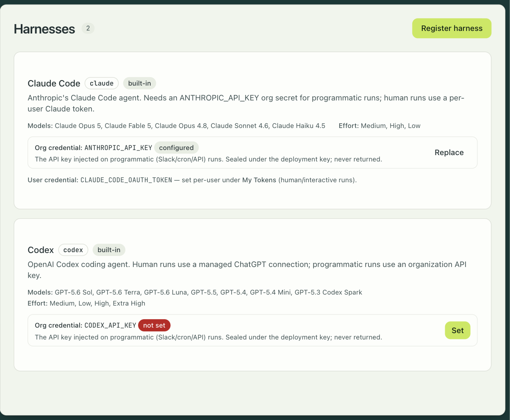

## Images

A session image is a plain OCI image. You build it with `docker build`, push it with
`docker push` to any registry, and tell engrams about it once. There is no build tool, no
manifest format, and nothing of engrams inside the image. The contract is any Linux image
with `/bin/sh`.

```
my-repo/
├── Dockerfile
└── ... your code
```

```sh
docker build -t registry.example.com/team/api:warm-1 .
docker push registry.example.com/team/api:warm-1
```

Two requirements are worth stating. Use a glibc-based image: the bundled harness binaries do
not run on Alpine, and a session on a musl image never becomes active. And install what your
agent needs to work: `git`, `curl`, and the like are your workspace's requirements, not the
platform's, so they go in your Dockerfile.

`/workspace` is the working directory. engrams runs no git operations of its own; the
repositories a profile lists are cloned into it, and the agent takes it from there.

## The image config

Settings that are not part of the image live in a TOML file you pass when you enable it:
a display name, environment variables, a working directory, the VM's size, and a warm hook.
The config describes what the image is. What a session may reach and what secrets it holds
are session policy, set on the profile, so the same image serves a locked-down profile and a
permissive one. The config is stored by engrams, not in the image, so a settings change is
not a rebuild.

```toml
name = "team-api"
description = "The backend API service"

[env]
NODE_ENV = "development"

[resources]
suggested_vcpus = 2
suggested_memory_mib = 4096

[warm]
command = ["pnpm", "install"]
timeout_secs = 300
```

```sh
engrams image enable --uri registry.example.com/team/api:warm-1 --config ./image-config.toml
```

Enabling is the expensive step. engrams pulls the image, writes it as chunks into the blob
store, boots a capture VM on the fleet, runs the warm hook, and freezes the result as the
image's base snapshot. Sessions boot from that snapshot in under a second, with whatever the
warm hook left running still running. `engrams image jobs` shows the capture as it happens.

Cheap fields, like the name and environment, take effect on the next session. Changing the
resources or the warm hook means a new capture, and `engrams image update` asks you to say
so with `--allow-recapture`. The [image config reference](../../reference/image-config/)
lists every field.

## Harnesses

A harness is the agent runtime inside the VM. It is a read-only bundle that each host stages
and mounts into the VM at boot, alongside the in-guest daemon and the skills. Your image never
contains it, so a new agent version rolls out to the whole fleet without a rebuild, and one
image can run under different harnesses.

Two harnesses ship, and Settings → Harnesses shows them with their models, effort levels, and
credential status. [Bring your own harness](../../guides/custom-harness/) is the contract for
registering a third.



**Claude Code** runs Anthropic's agent. It offers the Opus, Sonnet, and Haiku models, a Build
mode and a Plan mode, and three effort levels that map to the agent's thinking budget. For
sessions a person starts, it uses that person's Claude Code token, which you paste into
Settings once (`claude setup-token` prints it). For sessions started by Slack, cron, or the
API, it uses an org secret named `ANTHROPIC_API_KEY`.

**Codex** runs OpenAI's agent. It offers the GPT-5 family, the same Build and Plan modes, and
four effort levels. Personal sessions use a ChatGPT connection made in Settings, which the
harness refreshes from inside the VM; programmatic sessions use an org secret named
`CODEX_API_KEY`.

Either harness can be pointed at a model router instead of the provider's own API. OpenRouter
is built in; an admin connects it under Settings → Model routers, and its models appear in the
picker.

A harness declares which hosts it must reach, and the egress proxy allows exactly those plus
whatever the profile allows. Harness credentials sit one layer above the image: they are
resolved when the session is created and injected into the harness's environment, never
written into the image or the snapshot.
