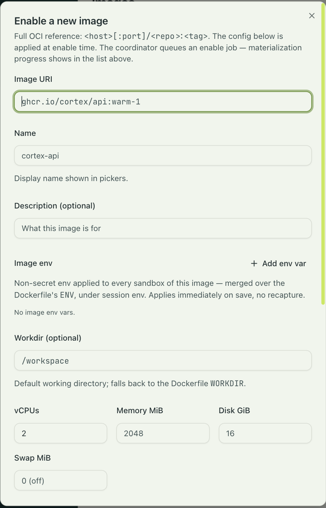

## Images

A session image is a plain OCI image. You build it with `docker build`, push it with
`docker push` to any registry, and tell engrams about it once. There is no build tool, no
manifest format, and nothing of engrams inside the image. The contract is any Linux image
with `/bin/sh`.

```
my-repo/
├── Dockerfile
└── ... your code
```

```sh
docker build -t registry.example.com/team/api:warm-1 .
docker push registry.example.com/team/api:warm-1
```

Two requirements are worth stating. Use a glibc-based image: the bundled harness binaries do
not run on Alpine, and a session on a musl image never becomes active. And install what your
agent needs to work: `git`, `curl`, and the like are your workspace's requirements, not the
platform's, so they go in your Dockerfile.

`/workspace` is the working directory. engrams runs no git operations of its own; the
repositories a profile lists are cloned into it, and the agent takes it from there.

## Enabling an image

Settings that are not part of the image are entered when you enable it, under Operator →
Images → Enable a new image: a display name, environment variables, a working directory, the
VM's size, and a warm hook. They describe what the image is. What a session may reach and
what secrets it holds are session policy, set on the profile, so the same image serves a
locked-down profile and a permissive one. engrams stores the settings, not the image, so a
settings change is not a rebuild.



| Field | Meaning |
|---|---|
| Image URI | The full OCI reference, `<host>[:port]/<repo>:<tag>`. Fixed once enabled. |
| Name, Description | The display name in pickers, and free text. |
| Image env | Non-secret environment variables for every session of this image. The Dockerfile's `ENV` is read at enable time and merged underneath, so a key here overrides the same key in the image, and a value the session supplies overrides both. |
| Workdir | The working directory for the harness and for `engrams session exec`. Defaults to the Dockerfile's `WORKDIR`, then to `/`. The directory must exist in the image. |
| vCPUs | Required. Placement reserves it against a host's CPU budget. |
| Memory MiB, Disk GiB, Swap MiB | The guest's memory, the session's disk budget, and an ephemeral swap device that is discarded at every snapshot. Swap of 0 means none; a good default is a quarter of memory, clamped between 1 GiB and 8 GiB. |
| Warm capture hook | A command run once at enable time, with its own timeout, working directory, capture-time environment, and network policy. See [Authoring a warm hook](../../guides/warm-hooks/). |

The CLI covers the fields a script needs. The warm hook is set in the dashboard.

```sh
engrams image enable --uri registry.example.com/team/api:warm-1 --name team-api --vcpus 2 --memory-mib 4096
```

Enabling is the expensive step. engrams pulls the image, writes it as chunks into the blob
store, boots a capture VM on the fleet, runs the warm hook, and freezes the result as the
image's base snapshot. Sessions boot from that snapshot in under a second, with whatever the
warm hook left running still running. The Images page shows the capture as it happens, and
so does `engrams image jobs`.

Cheap fields, like the name and environment, take effect on the next session. Changing the
resources or the warm hook means a new capture, so the dialog asks you to confirm, and
`engrams image update` asks for `--allow-recapture`. Sessions keep working against the old
snapshot until the new one is ready.

## Harnesses

A harness is the agent runtime inside the VM. It is a read-only bundle that each host stages
and mounts into the VM at boot, alongside the in-guest daemon and the skills. Your image never
contains it, so a new agent version rolls out to the whole fleet without a rebuild, and one
image can run under different harnesses.

Two harnesses ship, and Settings → Harnesses shows them with their models, effort levels, and
credential status. [Bring your own harness](../../guides/custom-harness/) is the contract for
registering a third.


**Claude Code** runs Anthropic's agent. It offers the Opus, Sonnet, and Haiku models, a Build
mode and a Plan mode, and three effort levels that map to the agent's thinking budget. For
sessions a person starts, it uses that person's Claude Code token, which you paste into
Settings once (`claude setup-token` prints it). For sessions started by Slack, cron, or the
API, it uses an org secret named `ANTHROPIC_API_KEY`.

**Codex** runs OpenAI's agent. It offers the GPT-5 family, the same Build and Plan modes, and
four effort levels. Personal sessions use a ChatGPT connection made in Settings, which the
harness refreshes from inside the VM; programmatic sessions use an org secret named
`CODEX_API_KEY`.

Either harness can be pointed at a model router instead of the provider's own API. OpenRouter
is built in; an admin connects it under Settings → Model routers, and its models appear in the
picker.

A harness declares which hosts it must reach, and the egress proxy allows exactly those plus
whatever the profile allows. Harness credentials sit one layer above the image: they are
resolved when the session is created and injected into the harness's environment, never
written into the image or the snapshot.
