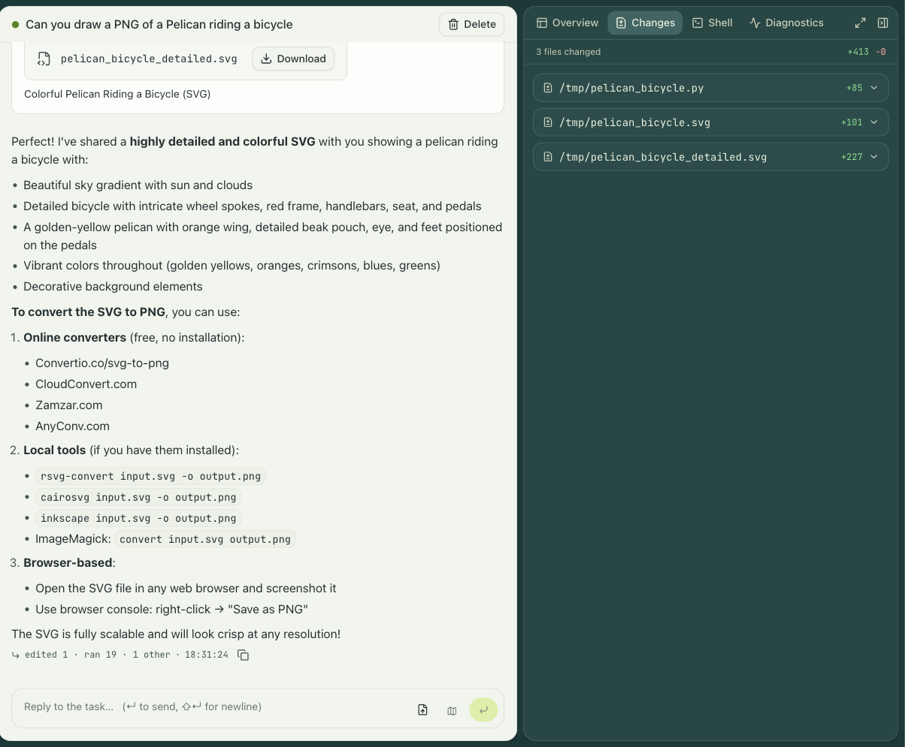

This page assumes a running stack with the demo image enabled, per
[Run engrams locally](../local-quickstart/). It uses the CLI because a terminal shows the
moving parts; the dashboard does the same things with a form.

## Build the CLI

The `engrams` CLI is a single binary built with Bun:

```sh
(cd cli && bun install && bun run build)
```

That leaves `cli/dist/engrams`. Put it on your `PATH` or call it by path; the examples below
call it by path.

## Point it at the stack

The CLI needs a URL and a credential. For scripts, both come from the environment:

```sh
export ENGRAMS_URL=http://localhost:8787
export ENGRAMS_API_KEY=$(cat var/dev-api-key)
```

`var/dev-api-key` holds an admin key that `just dev` mints for exactly this purpose. Against a
real deployment you would run `engrams auth login` instead, which opens a device-code flow in
the browser and stores a personal key in `~/.config/engrams/hosts.json`. The
[CLI reference](../../reference/cli/) covers the precedence.

## Start a session

```sh
SID=$(cli/dist/engrams session create \
  --image localhost:5001/demo:warm-1 \
  --harness claude \
  --prompt "List /workspace and describe what you find.")
echo "$SID"
```

The command prints the session id as soon as the coordinator has accepted it. Behind that
line, a host restored the image's base snapshot into a fresh VM, the in-guest daemon came up,
and the Claude Code harness started with your prompt.

Watch the transcript:

```sh
cli/dist/engrams session logs "$SID"
```

This tails the session's event log: the agent's messages, each tool call as it starts and
finishes, and the run's completion. `--since 0` replays from the beginning. The same events
are what the dashboard renders, so open the session there too. The right pane has the
session's overview, the files it changed with their diffs, a shell into the VM, and
diagnostics.



Run a command inside the VM while the agent works:

```sh
cli/dist/engrams session exec "$SID" 'uname -a; ls /workspace'
```

`session exec` streams stdout and stderr and exits with the remote command's exit code. The
dashboard's Shell tab is the interactive version, a terminal in the VM as root.


## Watch it snapshot and resume

Leave the session alone. A few minutes after the agent's last event, the idle timeout fires:
the host snapshots the VM's memory and disk and destroys it. `session get` shows the session
as idle and it holds no host resources.

Now send another prompt:

```sh
cli/dist/engrams session prompt "$SID" "Now write a short README for what you found."
```

The prompt resumes the snapshot, and the agent continues in the same process with the same
context, because the memory it had is the memory it gets back.

When you are done:

```sh
cli/dist/engrams session delete "$SID"
```

## Tasks and profiles

`session create` is the admin's escape hatch: it takes a raw image URI and needs no setup
beyond an enabled image. Day to day, work starts as a task from a profile:

```sh
cli/dist/engrams task create --profile backend --prompt "Fix the flaky test in CI"
```

A profile bundles the image, the repositories to clone, environment variables, the egress
policy, integration access, and skills, so the person launching a task chooses a name rather
than a configuration. Profiles are created in the dashboard under Settings. `engrams profile
list` shows the ones you can use.
