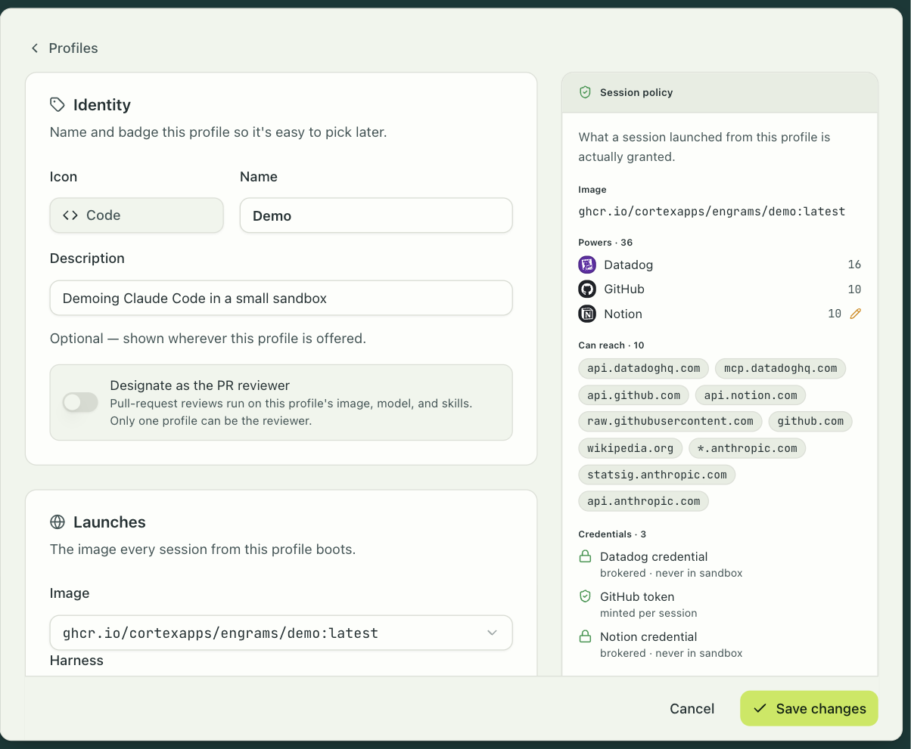
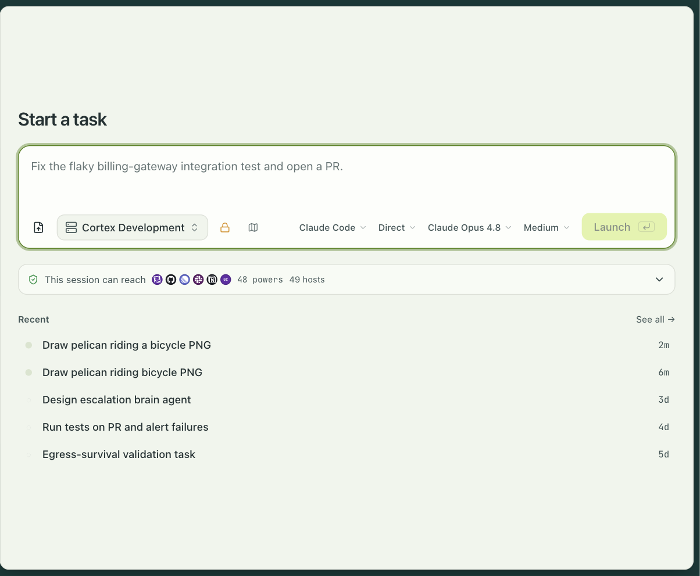

engrams is an open-source system that runs AI coding agents in isolated microVMs on your own
infrastructure. It gives people one place to direct their work: start a task, inspect its
changes, and continue the conversation from the dashboard or Slack. Turn repeat work into an
automation that starts on a schedule or an event.

Each agent runs in its own Firecracker microVM. engrams supplies the environment, controls
access to connected tools, and snapshots idle sessions so work can continue later. Claude
Code and Codex ship as harnesses; custom harnesses use the same session controls.

## The objects

A **session** is one running sandbox. It pairs an image with an optional harness and lives in
one microVM on one host. Everything else is defined in terms of sessions.

An **image** is a plain OCI image you build with `docker build` and push to any registry. The
contract is any Linux image with `/bin/sh`. You enable an image once; engrams turns it into a
chunked root filesystem and captures a base snapshot on the fleet, and sessions boot from that
snapshot. Runtime settings that are not part of the image, like environment variables, memory,
and a warm-up command, are entered when you enable it.

A **harness** is the agent runtime that runs inside the VM. Claude Code and Codex ship as
harnesses. A harness is never baked into your image: the host stages it as a read-only bundle
and mounts it into the VM at boot, so upgrading the agent does not mean rebuilding images.

A **profile** is an admin-curated bundle of session settings: the image, the repositories to
clone, environment variables, the egress policy, which integrations the agent may use, and
which skills and session apps it gets. Profiles are how an organization hands developers a
known-good configuration. The profile editor shows, beside the form, exactly what a session
launched from it is granted: the image, the powers, the hosts it can reach, and how each
credential is delivered.

A **task** is one unit of agent work. It starts from a profile, gets a prompt, and owns one or
more sessions. Tasks are what you see in the dashboard, in a Slack thread, and in
`engrams task list`.

An **automation** is a trigger, a tree of blocks, and typed inputs. It starts sessions in
response to a schedule, a Slack mention, a pull request, a Linear issue, or a webhook, and
every run keeps a step-by-step record. [Pull request review](../../platform/reviews/) and
[Slack threads](../../platform/slack-threads/) ship as automations.
[Automations](../../platform/automations/) has the whole model.

A **host** is a Linux machine with KVM that runs microVMs. Hosts dial the coordinator, report
their capacity, and receive sessions. Hosts never need an inbound port.

## The life of a session

A session moves through a small set of states.

1. **Created.** The coordinator has picked a host and the host is booting a VM from the
   image's base snapshot.
2. **Active.** The in-guest daemon is up and the harness is running. Prompts, commands, and
   file transfers work. A session reaches this state only after the agent has started, so a
   command sent to an Active session never races the boot.
3. **Idle.** The agent went quiet for longer than the idle timeout. The host snapshotted the
   VM's memory and disk into content-addressed chunks and destroyed the VM. The session holds
   no host resources.
4. **Active again.** The next prompt, command, or event subscription restores the snapshot,
   on the same host if it still has the chunks cached, and on any other host otherwise. You do
   not have to know whether a session is live or paused; engrams resumes it for you.

Two states are terminal. **Completed** is what you get when you delete a session. **Dead** is
what happens when a session's snapshot can no longer be restored, which in practice means the
blob store lost the chunks or a hard time limit expired. If a host stops sending heartbeats
while a session is Active, the session becomes **HostLost**, and it returns to Idle if a
recoverable snapshot exists.

## What survives what

| Event                                  | Disk state          | Memory state        | Conversation log               |
| -------------------------------------- | ------------------- | ------------------- | ------------------------------ |
| Resume on the same host, chunks cached | preserved           | preserved           | preserved                      |
| Resume on a different host             | rebuilt from chunks | rebuilt from chunks | preserved                      |
| Every host lost, blob store intact     | preserved           | preserved           | preserved                      |
| Blob store lost                        | gone                | gone                | preserved in Postgres          |
| Host crash before the first snapshot   | gone                | gone                | up to the last persisted event |

The conversation log lives in Postgres, so a session's history outlives its VM in every case.

## What engrams is not

- **engrams is not a hosted service.** You run it, in your cloud or on your own hardware. If
  you want someone else to run the sandboxes, E2B and Modal do that well.
- **engrams is not a development environment for people.** Sessions exist for agents. You can
  open a shell or an IDE into one, but a workspace product for engineers at their editors is
  what Coder is for.
- **engrams is not a container runner.** Production isolation is Firecracker on Linux with
  KVM. The macOS backend on Apple Virtualization and the process backend exist for
  development only.
- **engrams is not a model provider.** You bring an Anthropic or OpenAI key, or point a
  harness at a router such as OpenRouter.

## Tested platforms

Production runs on Kubernetes with a dedicated node pool that has nested virtualization
enabled. That is Intel-only on every managed provider today.

| Cloud        | Cluster      | KVM nodes                          |
| ------------ | ------------ | ---------------------------------- |
| Google Cloud | GKE Standard | C3 family (Sapphire Rapids)        |
| AWS          | EKS          | m8i (Granite Rapids), or `*.metal` |

For development, an Apple Silicon Mac runs sessions under Apple's Virtualization framework,
and any Linux machine with `/dev/kvm` runs them under Firecracker.

Two limits are worth knowing before you plan a deployment. The CPU platform is a one-way door
for snapshots: an image whose base snapshot was captured on a newer CPU never restores on an
older one, so a fleet that mixes platforms has to bake images per platform. And the built-in
harnesses need a glibc-based image; an Alpine image boots, but the bundled agent binary exits
at once and the session never becomes Active.
