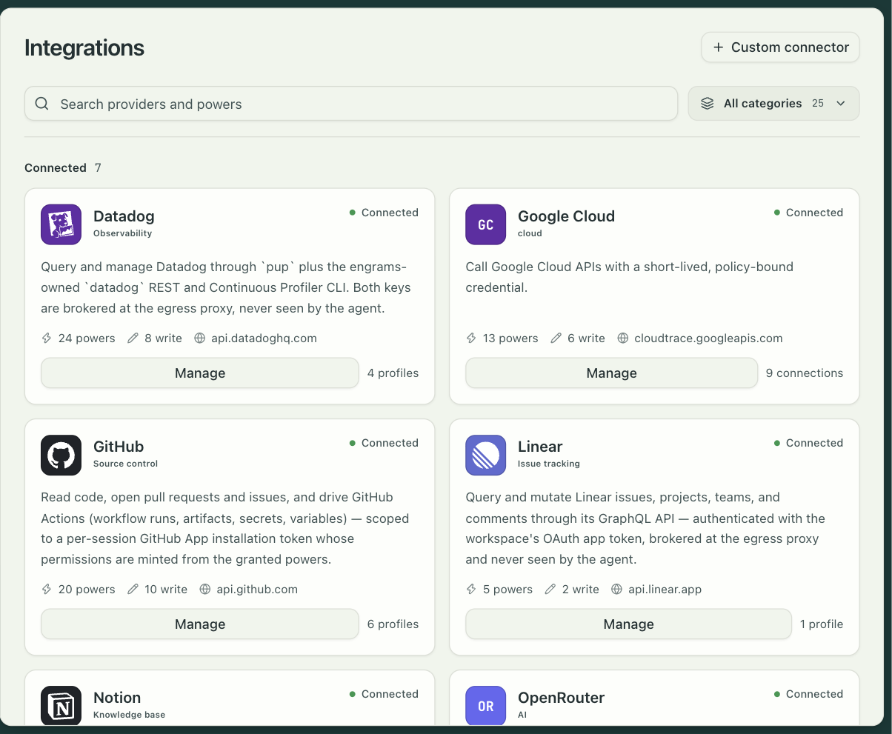

Connecting Slack gives you two things: sessions can post to Slack through the organization's
connection, and a person can start a session by mentioning the bot in a channel. The second
is the Slack thread brain, a built-in automation that keeps one session per thread and
relays the conversation both ways.

You bring your own Slack app. The dashboard writes its manifest for you.



## Create the app

1. Open Settings → Integrations → Slack → Connect. The sheet shows the redirect URL and a
   Copy app manifest button.
2. At api.slack.com/apps, create an app from a manifest and paste what you copied. The
   manifest names the app `engrams`, requests the bot scopes engrams needs, sets the OAuth
   redirect URL, subscribes to `app_mention` events at the events URL, and enables
   interactivity at the interactivity URL. The three URLs are all under your deployment's
   public origin:

   ```
   <origin>/api/v1/integrations/slack/oauth/callback
   <origin>/api/v1/integrations/slack/events
   <origin>/api/v1/integrations/slack/interactivity
   ```

3. From the app's Basic Information page, copy the client ID, the client secret, and the
   signing secret.

The scopes include `users:read.email`, which is how a Slack author is matched to an engrams
user. Without a match the bot replies that the person needs to log in to engrams first and
starts nothing.

## Connect it

Back in the sheet, paste the client ID, the client secret, and the signing secret. The
signing secret is optional for the connection itself but required to receive events, so
paste it if you want mentions to work. Select Add Slack. engrams seals the three values as
org secrets, sends you through Slack's consent screen, and returns to the integration page
marked connected. Reconnect from that page at any time forces a fresh consent.

## Turn on the thread brain

Mentions do nothing until a channel is mapped to a profile. Open Settings → Automations →
Slack thread brain → Inputs and add the channel to the `channels` map, choosing the profile
its sessions run on. A channel that is not in the map is never answered. The other inputs
are `default_profile`, `idle_timeout` (how long a thread may go quiet before its run ends,
one minute to a day, an hour by default), and `max_turns`. Then enable the automation.

The bot must be a member of a channel to see messages in it. Public channels can be joined
by the automation; a private channel needs a person to invite the bot.

## What people get

Mention the bot in a channel or a thread. engrams checks that the author is a linked user,
starts a session on the channel's profile as that person, with their credentials and git
identity, and replies in the thread as the agent works: messages arrive as the agent
produces them, questions from the agent become Slack forms, and a reaction marks each turn
as in progress and then done. Replies in the thread continue the same session; the run ends
when the thread goes quiet for the idle timeout, and the session is kept so someone can pick
it up in the dashboard later.

## Personal Slack credentials

A profile can be set to act as the person who launched it rather than as the organization.
For that, each person connects their own Slack account under Settings → Credentials, which
runs the same OAuth flow with user scopes. Sessions started from such a profile post as the
person.
