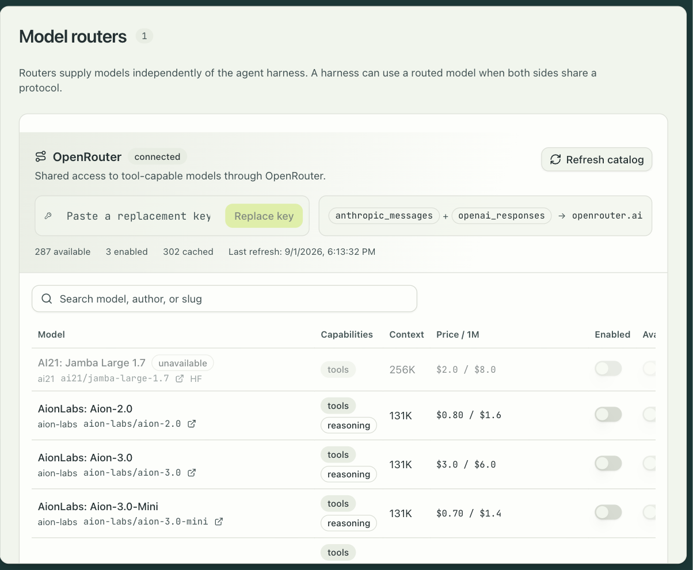

A model router supplies models independently of the agent harness. The harness still runs
the agent loop; the router changes where its model calls go. Claude Code speaks the
Anthropic Messages protocol and Codex speaks the OpenAI Responses protocol, and a router
that serves both can sit behind either one. OpenRouter is the router that ships, and it
serves both.

## Connect OpenRouter

You need one thing from OpenRouter: an API key. There is no OAuth application, no callback
URL, and no webhook.

1. Open Settings → Model routers. The OpenRouter card says "key required" until a key is
   saved, and until then the router is invisible everywhere else: no Route option in the task
   composer or the profile editor, and no catalog refresh.
2. Paste the key and select Save key. It is stored as the org secret `openrouter.api_key`,
   sealed like every other org secret.
3. Select Refresh catalog. engrams fetches OpenRouter's model list, keeps the models that
   produce text and support tools, and drops the rest. The catalog refreshes on its own every
   six hours after that; if a refresh fails, the card shows the error and the last good
   catalog stays in use.

## Decide who may launch what

A fresh catalog is inert: every model arrives disabled. Each row has two switches.

| Switch | Who it opens the model to |
|---|---|
| Enabled | Programmatic runs: Slack, schedules, webhooks, the API. |
| Available to users | People, in the task composer's model picker. Requires Enabled. |

The table shows each model's capabilities, context window, and price per million tokens,
with a search box over name, author, and slug, and a link to the model's page on OpenRouter.
A model that OpenRouter has withdrawn stays in the table marked unavailable so you can see
what changed, and cannot be launched.

## Use a routed model

In the task composer and in a profile, the Route control offers the native provider and
every connected router whose protocols overlap the selected harness. Pick OpenRouter and the
model list becomes the routed catalog. A profile's route is its default; a task can override
it. Switching to a harness that cannot speak the router's protocol clears the route.

Three things change on a routed launch, and all of them are enforced before the session
boots.

- **Egress.** The session may reach `openrouter.ai` and may not reach the provider's own
  API hosts. A routed Claude Code session cannot call Anthropic directly, and a routed Codex
  session cannot reach OpenAI or ChatGPT.
- **Credentials.** The router key is brokered at the egress proxy for `openrouter.ai` and is
  never in the VM's environment. The person's own Claude Code token or ChatGPT connection is
  not injected, so someone with no provider credential of their own can still start a routed
  session. The organization's `ANTHROPIC_API_KEY` or `CODEX_API_KEY` is not injected either.
- **Effort.** If the model does not advertise reasoning support, the effort setting is
  dropped rather than sent.

A launch is refused, with the reason, when the harness has no adapter for the router's
protocol, the model is unavailable, the model is not enabled for the caller, or the key is
missing.

## What routes today

OpenRouter is the only router, and the router list is part of the release, not something an
admin can extend. Adding a second router means a change to engrams.
