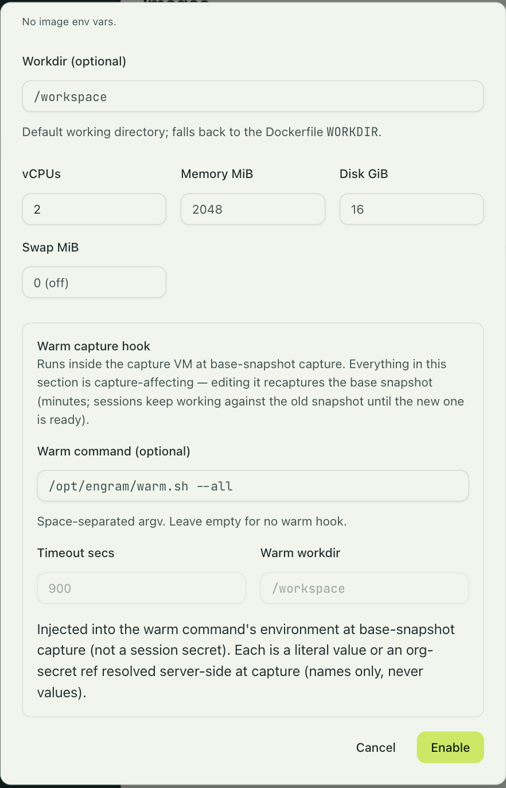

An image's warm capture hook is a command that runs inside the capture VM, once the
in-guest daemon is ready and just before the base snapshot is frozen. Whatever the command
leaves behind is in the snapshot, so every session of that image starts with it. The classic
case is a build daemon: `gradle --daemon help` starts the Gradle daemon as a separate process
and returns, the daemon is captured live, and every restored session inherits a warm,
cache-hot daemon with no cold start.

You set it in the Warm capture hook section of the image's config, under Settings → Images.
This page is the contract for writing one.



| Field | Meaning |
|---|---|
| Warm command | The command, as space-separated arguments. It runs inside the capture VM once the in-guest daemon is ready and before the snapshot is frozen. It must exit; anything it leaves running is captured live. Empty means no hook. |
| Timeout secs | The global deadline, 600 seconds by default. The in-guest daemon kills the command at this point and the capture fails. |
| Warm workdir | The command's working directory. Defaults to the image's workdir. |
| Warm capture env | Capture-time environment entries. Each is a literal value or a reference to an org secret by name. References are resolved at capture through the same store sessions use and are never stored resolved; an unresolvable reference fails the capture. |
| Warm network | The capture VM's network while the command runs: no network (the default), deny by default with an allow-list of hosts and host patterns such as `*.githubusercontent.com`, or allow all. |

Everything in this section is captured into the base snapshot, so any change to it means a
recapture, and the dialog asks you to confirm.

## What a hook may assume

**A ready guest.** The in-guest daemon has come up, and the image's effective environment,
the image env over the Dockerfile's `ENV`, is merged with the warm capture env and injected
into the hook's environment.

**Egress per the warm network setting.** By default the capture VM has no network at all: no
policy is registered, so the proxy denies everything. A hook that needs the network opts in,
either with allow-all for a development image where no agent runs at capture, or with
deny-by-default plus allowed hosts and host patterns. Changing the network setting, like
anything in the warm hook, means a recapture.

**No per-session secrets.** The capture VM never gets a session, so it never gets a session's
secrets. The warm capture env is the only secret-bearing input a hook gets; its values may be
literals or secret references resolved against the same store a session uses, and an
unresolvable reference fails the capture. Everything the hook writes is frozen into the base
snapshot, so treat the snapshot as secret-bearing storage if the hook used a secret.

**No TTY.** The hook runs as a plain exec, not an interactive shell.

**A fresh VM per attempt.** Every capture attempt, including a retry, boots a new VM from a
fresh pull of the image, so the hook runs from scratch each time. Any side effect it has
outside the VM, such as a webhook call or a registration, must be safe to repeat.

**It must exit.** A hook that starts a daemon and returns is the intended shape. A hook that
runs forever is killed at the global timeout and the capture fails.

## It fails loud

A non-zero exit, a stall, a blown stage deadline, or the global timeout all abort the capture
and the enable. engrams never ships a "cold" base snapshot that a hook claimed to warm, and
there is no partial credit: fix the hook and retry the enable job.

## Three deadlines

Three budgets apply and the tightest wins.

- **The stage deadline**, `deadline_secs` on a stage's `start` line, fires on wall-clock time
  since that stage started, regardless of output. A stage that is chatty but stuck still
  dies on its budget. It applies only if the stage declares one.
- **The stall budget**, `ENGRAM_WARM_STALL_SECS` on the host with a default of 120 seconds,
  fires when no output and no progress line has arrived for that long. It arms only once the
  hook has emitted its first valid progress line; a hook that never emits one gets only the
  global timeout. Any stage that waits, on a health check or a poll loop, must emit
  heartbeats, or the platform cannot tell slow from wedged.
- **The global timeout**, the hook's timeout field with a default of 600 seconds, is the
  backstop. The in-guest daemon kills the hook at this deadline no matter what the
  other two would allow.

## The progress protocol

A hook reports progress by printing lines with a sentinel prefix on stdout. Tokens are
space-separated `key=value` pairs; `msg=` runs to the end of the line, so it comes last;
unknown keys are ignored; a line that does not parse is ordinary output, which resets the
stall clock but is not a stage transition.

```text
::engram-warm:: event=start stage=<name> [deadline_secs=<u64>] [msg=<free text>]
::engram-warm:: event=heartbeat [stage=<name>] [msg=<free text>]
::engram-warm:: event=done stage=<name>
```

A `start` closes the previous stage on its own, so you do not need a `done` before the next
`start`. A `heartbeat` resets the stall clock but not the stage deadline. A `done` closes the
current stage explicitly. stderr is captured into the output tail and resets the stall clock
like any output, but it is not parsed for progress lines.

```sh
#!/bin/sh
set -e
echo "::engram-warm:: event=start stage=deps-up deadline_secs=120"
./install-deps.sh
echo "::engram-warm:: event=done stage=deps-up"

echo "::engram-warm:: event=start stage=migrations deadline_secs=60"
./run-migrations.sh
echo "::engram-warm:: event=done stage=migrations"

echo "::engram-warm:: event=start stage=wait-ready deadline_secs=300"
until curl -fsS localhost:8080/healthz >/dev/null 2>&1; do
    echo "::engram-warm:: event=heartbeat stage=wait-ready msg=still waiting on healthz"
    sleep 5
done
echo "::engram-warm:: event=done stage=wait-ready"

# Start the long-lived process detached, then exit. It is captured live.
nohup ./run-server.sh >/var/log/server.log 2>&1 &
disown
exit 0
```

## What you get for it

While a capture runs, the enable job shows the current phase and stage, updated at least
every 30 seconds even through a healthy silent wait; `engrams image job <id>` prints them.
When a capture fails, whether on exit code, stall, stage deadline, or the global timeout, the
job keeps the failing stage's name and the hook's last 16 KiB of combined output, so you can
diagnose it from the dashboard or the CLI without host access.

The watchdog runs above the sandbox backend, so stall detection, stage deadlines, and the
output tail behave the same on every backend that captures.
