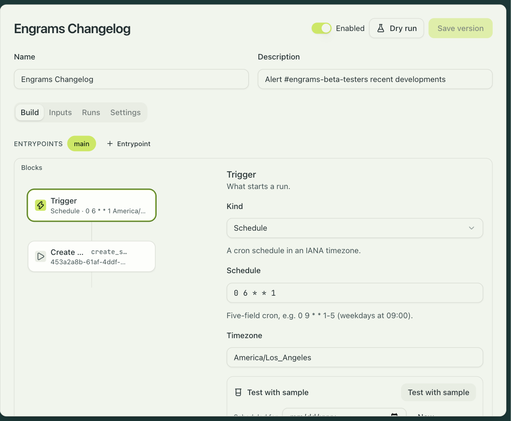
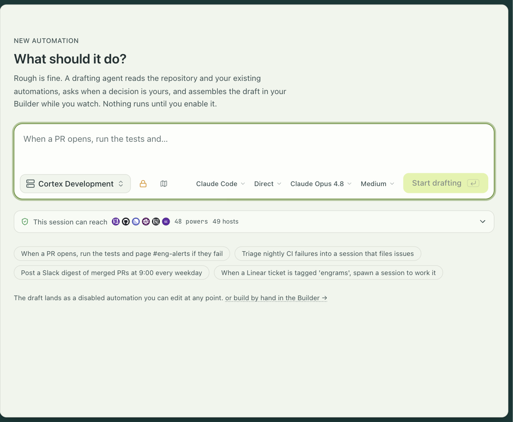
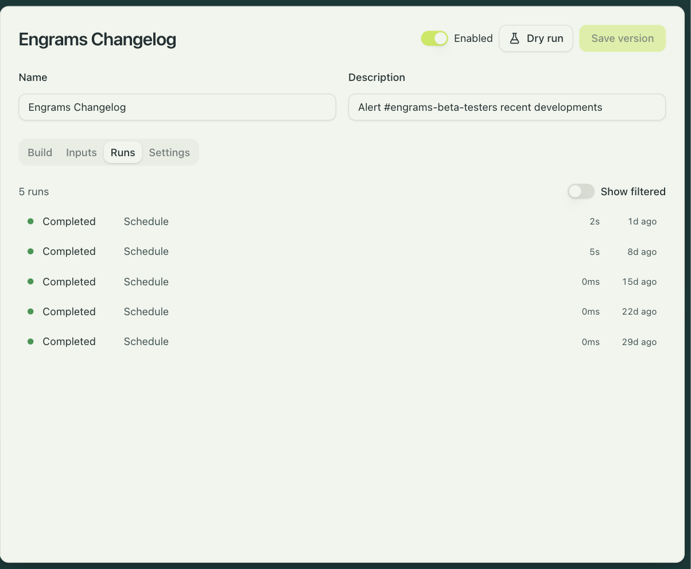

An automation is a small program that starts agent sessions in response to something
happening: a pull request opening, a Slack mention, a schedule, a webhook from a system you
run. It is the part of engrams that turns "an agent I can talk to" into work that happens
without anyone typing a prompt.

An automation has one trigger, an ordered tree of blocks, a typed set of inputs, and a few
settings. The blocks create sessions, send them prompts, wait for them, run commands inside
them, post to Slack or GitHub, branch, loop, and read and write a small key-value store.
Every run is durable: it survives a server restart and picks up where it was, and a run can
wait hours for an event without holding anything open.



## Two ways to write one

**Describe it.** Settings → Automations → New automation opens a prompt: "When a PR opens,
run the tests and page #eng-alerts if they fail." A drafting agent reads your repository and
your existing automations, asks when a decision is yours, and assembles a draft on the
canvas while you watch. The draft lands disabled. You edit it by hand, and the agent and you
can edit at the same time.

**Build it.** The builder is a canvas: the trigger is the first node, a plus sign on any edge
inserts a block, and an inspector on the right edits the selected block's fields. Nothing
here is JSON in disguise; when the server rejects a definition, the error points at the
block and the field.

Every save is a new version. Runs that are in flight finish on the version they started with,
and the Settings tab shows the version history with a diff.



## Triggers

| Trigger | Fires on | You set |
|---|---|---|
| Integration event | An event from GitHub, Slack, or Linear | the provider, the event keys, and a scope: an explicit list, or the keys of one of your map inputs |
| Schedule | A cron expression in an IANA timezone | the schedule and the timezone; one schedule per automation |
| Webhook | A signed request from a system without a connector | a registration (see below), the event keys, and an optional filter on the payload |
| Manual | The Run now button | nothing |

GitHub events cover pull requests opening, updating, and closing, review comments, issues,
pushes, check runs, and releases. Slack events are app mentions, messages, and reactions.
Linear events are issue and comment creation and updates. An integration trigger can mark
some event keys as continue-only: they never open a run, they only join one that is already
open. That is how a reply in a Slack thread reaches the run that owns the thread and never
starts a second one.

## Blocks

**Sessions.** Create session starts an agent from a profile with a prompt, and can override
the harness, model, effort, network policy, and capabilities the profile grants. Send prompt
delivers a follow-up and waits for the turn to end, for a signal, or for nothing. Wait for
session parks until the session is idle or ended. Session status reads a session without
touching it. End session tears one down; sessions a run creates are kept by default.

**Inside a session.** Run command executes a shell command in the sandbox and captures its
output and exit status. Write files places rendered files into the sandbox's filesystem.

**Integrations.** Integration action calls an action on a connected integration with the
organization's credential: post or update a Slack message, join a channel, post a pull
request review, create or update an issue comment, set a commit status, create a Linear
issue or comment. The credential is resolved on the server and the block never sees it.

**Control.** Filter ends the run quietly when its conditions fail. Branch runs one of two
lists. Loop repeats a list until a condition holds or an iteration cap is reached. Code runs
a JavaScript module in a sandbox with no network, no timers, and no filesystem, to compute a
value or a yes-or-no; it gets 250 ms of CPU.

**Events.** Wait for event receives the next delivery routed into this run, with an optional
deadline, and is what a conversation-shaped automation loops on.

**State.** Read, write, delete, and list entries in a per-automation key-value store. A write
can carry an expected version, which makes it a compare-and-swap, and a miss is an output
you branch on rather than an error.

**Routing.** Look up PR session maps a pull request to the session that authored it, so
review feedback can go back to the agent that wrote the code. Claim handle binds an external
identifier to the current workstream so later events route to it.

Text fields are templates with `${{ … }}` placeholders and a small set of filters. Every block
can see the inputs, the trigger, the event, and the outputs of earlier blocks by id. A block
can retry up to five times on transient errors.

## Runs

A run is `completed`, `filtered` (a filter or a boolean code block ended it on purpose),
`failed`, `superseded`, `halted` (stopped by a person), or `deadline`. The Runs tab lists them
with the trigger that started each one, and consecutive filtered runs collapse so noise does
not bury the runs that did work. A run's page is a step timeline; each step opens to its
inputs, its outputs, its output text, and the session it used.



Retry starts a fresh run with the same trigger payload. Stop asks a run to halt at its next
checkpoint. A run deadline, up to 48 hours, ends a run that outlived its usefulness.

**Concurrency** is a setting on the automation: a key template rendered when an occurrence
arrives, and a policy for what happens when a run with that key is already active.

| Policy | What happens to the new occurrence |
|---|---|
| `queue` | Waits, and starts when the current run finishes. |
| `supersede` | Takes over; the current run ends as superseded. Pull request review uses this, keyed on the PR, so a new push cancels the review in flight. |
| `skip` | Is recorded as a filtered run and dropped. |
| `join` | Is delivered into the active run, where a Wait for event block receives it. One run per Slack thread works this way. |

**Finalize hooks** run one block when a run ends in a status you choose. They can post a recap
or flip a status comment, and they can never change the run's outcome.

**Workstreams** give a long-lived thing, such as a Linear project or a support thread, a
durable identity that many short runs contribute to. The Workstreams tab lists each one with
its runs and the handles it has claimed, and a recent-drops list explains why a delivery did
not start a run.

## Inputs

Inputs make an automation configurable without editing it. Each input has a key, a label, a
type, and an optional default, and the Inputs tab renders them as a form: strings, numbers,
booleans, enums, lists, maps keyed by repository or channel or team, free-form JSON, and
references to org secrets by name. A map input's keys can be the trigger's scope, so adding a
repository to a map is how you enroll it.

Credentials never live in a definition. Integration actions use the organization's
connection. A secret reference input holds a name that the server resolves at run time. A
session gets what its profile grants, and a block can narrow that further: deny-default
network, drop the profile's secrets, add a system prompt. A session can also be created on
behalf of a particular person, so it runs with that person's credentials and git identity.

## The built-ins

Two automations ship with engrams. They are created disabled and stay that way until you
configure them. Their structure is locked, their inputs and a few marked fields are yours to
set, and Duplicate gives you a fully editable copy.

**PR review** listens for pull requests on the repositories you list. [Pull request
review](../reviews/) has the whole product; in short, it opens a review pass,
posts an acknowledgment comment, starts a finder session and a verifier session on the
reviewer profile with a deny-default network and no profile secrets, clones the pull request
head, runs the finder and then the verifier, settles the findings through a policy gate,
posts them as a single GitHub review, and updates the acknowledgment with the count. A new
push supersedes the review in flight. Each repository is `auto`, which reviews every pull
request, or `on_request`, which reviews when someone comments `@<handle> review`.

**Slack threads** answers mentions in the channels you map to profiles. A mention opens one
run for the thread; the author must be a linked engrams user, and the session runs as that
person. The run relays the agent's output into the thread as it streams, round-trips the
agent's questions as Slack forms, marks each turn with a reaction, and loops on thread
replies until the thread goes quiet for the idle timeout you set. The session is kept when
the run ends, so a person can pick it up later. [Slack threads](../slack-threads/) has the
setup.

## Custom webhooks

For a system without a connector, register a webhook under Settings → Automations. You
choose a slug, and the URL is `POST https://<your host>/api/v1/hooks/<slug>`. The response
shows the signing secret once; it is sealed into the org secret store and cannot be read
back, so rotation is delete and recreate.

The sender signs the raw body with HMAC-SHA256 and sends three headers:

```
X-Engrams-Signature-256: sha256=<hex of HMAC-SHA256(secret, body)>
X-Engrams-Event:         deploy.finished
X-Engrams-Delivery:      <an id, optional>
```

A bad signature is a 401, an unknown slug is a 404, a retired registration is a 410, and an
accepted delivery is a 200. Fields named like credentials are stripped from the payload before
it is stored. GitHub, Slack, and Linear do not use this path; they arrive through their
integrations.

## Limits

An automation has at most 64 blocks, 8 entrypoints, and 8 finalize hooks. A loop runs at most
100 iterations. A wait is at most 24 hours and a run at most 48. A command's output is kept up
to 256 KiB, and Write files takes up to 32 files and 4 MiB. There is no HTTP block, no sleep
block, and no approval block; a Slack question round-trip exists only inside the Slack
threads built-in. Retry restarts a run from the beginning.
