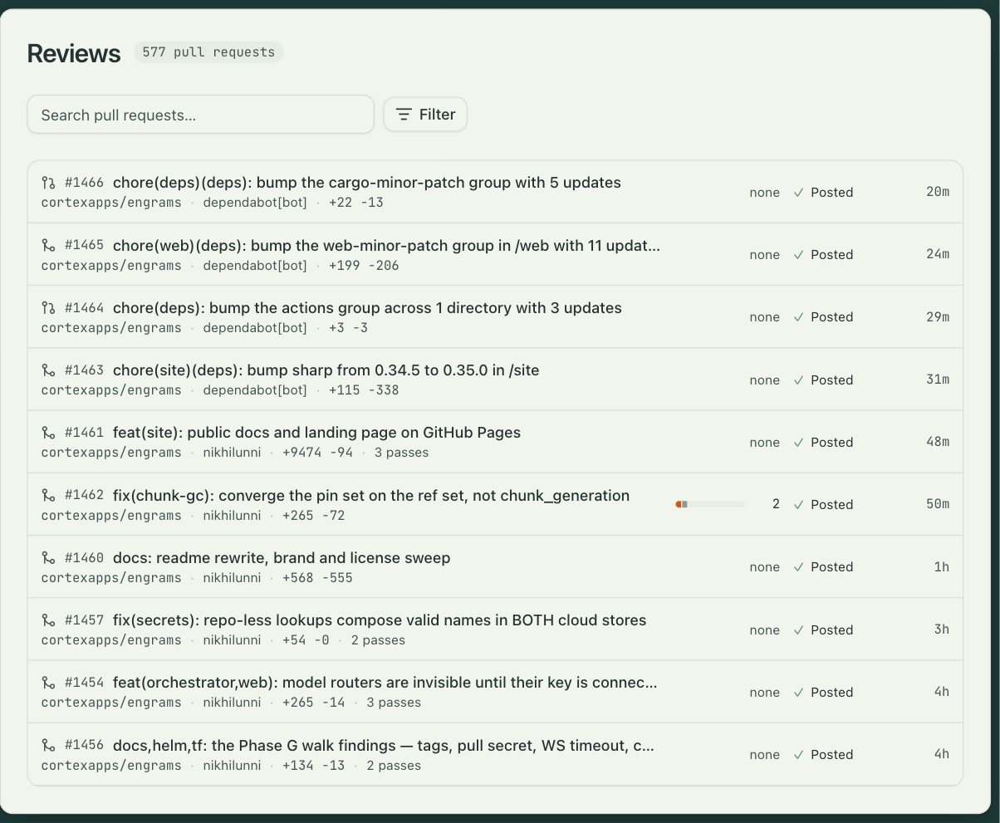

Pull request review ships as a built-in automation. Enable it, list the repositories it
should watch, and every pull request on them gets a review from two agents: a finder that
reads the diff and proposes findings, and a verifier that checks each one and drops what it
cannot confirm. What survives is posted to GitHub as one review with inline comments.

## Enrolling a repository

Open Settings → Automations → PR review → Inputs. The **repositories** map lists each
repository with two settings:

| Setting | Values | Meaning |
|---|---|---|
| Mode | `auto` or `on_request` | `auto` reviews every pull request when it opens, when new commits arrive, and when a draft is marked ready. `on_request` waits for a collaborator to comment `@<handle> review`. |
| Autofix | on or off | Whether the review may push fixes for the findings it is sure about. |

The other inputs are the **reviewer profile** the agents run on, the **mention handle** a
person uses to request a review (your GitHub App's login by default), the **review lenses**
to apply, and free-text **organization instructions** that both agents read.

The GitHub connection has to exist first; [Connect GitHub](../../guides/connect-github/)
covers the app and its webhook.

## What a review does

1. A new pull request opens a review pass and posts an acknowledgment comment: "engrams is
   reviewing `<sha>`."
2. The finder session starts on the reviewer profile with a deny-by-default network, no
   profile secrets, and read access to the repository's contents. It clones the pull request
   head and reads the diff with the lenses and instructions you set.
3. If the finder proposes anything, a verifier session starts the same way, takes each
   candidate, and confirms or rejects it.
4. A policy gate settles the confirmed findings, and one GitHub review is posted with inline
   comments. The acknowledgment comment is updated with the count.

A new push supersedes a review in flight: the running pass ends as superseded, its sessions
are torn down, and a fresh pass starts on the new head. Only the newest head ever gets a
review, so a busy pull request does not pile up stale comments.

## The Reviews page

Reviews in the sidebar is the ledger: one row per reviewed pull request, newest pass first,
with the repository, the author, the pull request's state, the stage the pass reached, and
the findings by severity. Filters narrow it by repository, author, state, stage, and
severity.

A row opens the pull request's dossier: the findings ledger, the state of the addressed pass,
and the finder's and verifier's transcripts, so you can see why a finding was kept or
dropped. Retry runs the pass again on the same head. The summary comment engrams posts on
GitHub links straight to the dossier.

## Where it lives

Pull request review is an automation like any other. Its structure is locked; its inputs are
yours, and Duplicate gives you a fully editable copy if you want a different flow. Each review
is an entry on the automation's Activity tab, with the same step trace every automation gets. See
[Automations](../automations/).
