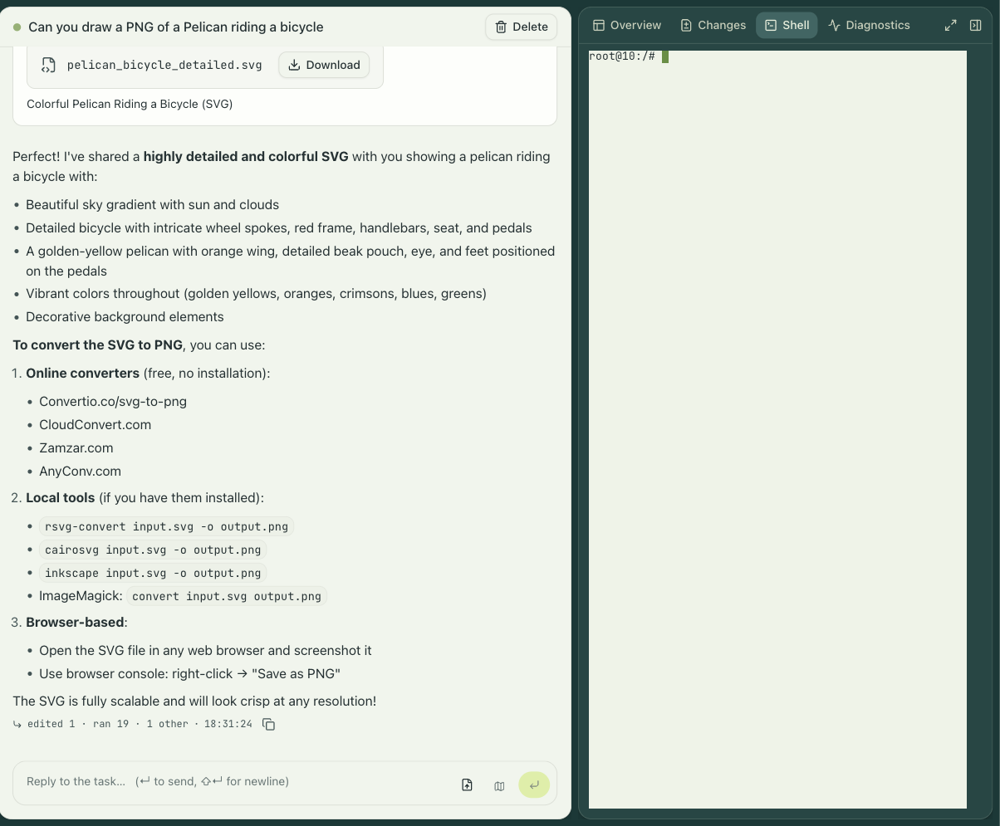

Most of what people do with engrams starts with a prompt. You pick a profile, type what you
want done, and an agent goes to work in its own microVM on a host you run. engrams is not the
agent: it runs the agent runtime you already use, Claude Code or Codex or your own, in the
cloud, with the isolation, the credentials, and the durability handled for you.

## A task and its sessions

A **task** is one unit of work: a prompt, a profile, and one or more sessions. A **session**
is one microVM running one harness. The dashboard, Slack, and `engrams task list` all show
tasks; a task's page is the transcript of its primary session. A task can spawn sub-tasks,
and the tree is shown on the parent.

A **profile** is what an admin hands you: the image, the repositories to clone, environment
variables, the egress policy, the integrations the agent may use, the skills it gets, and the
session apps it publishes. The composer shows, before you launch, exactly what the session
will be able to reach and which credentials it will carry.

## Starting one

From the dashboard, Start a task takes a prompt and a profile. Beside them are the pickers
the profile leaves open:

- **Harness**: Claude Code or Codex, or a harness your organization registered.
- **Mode**: Build, or Plan for a read-only pass that ends in a plan you approve.
- **Model** and **effort**: the harness's models and its effort levels, or a model from a
  connected router such as OpenRouter.

From Slack, mention the bot in a channel that is mapped to a profile; see
[Slack threads](../slack-threads/). From a script, `engrams task create --profile <name>`
does the same and attributes the session to your API key.

## While it runs

The session page streams every message and tool call as it happens. You can:

- **Reply and steer.** Type while the agent works; the prompt queues and can be edited or
  withdrawn until the agent reads it. Esc or Stop interrupts the current turn.
- **Open a shell.** A terminal into the VM, in the page or from `engrams session shell`.
- **Open the IDE or the browser.** When the profile grants them, a code editor and a
  browser run inside the VM and are tunneled to your page.
- **Read the changes.** The Changes tab shows the diff the agent has made so far, and the
  pull requests it opened.
- **Move files.** Upload into the VM and download out of it, from the page or the CLI.

## Pausing and resuming

When the agent goes quiet, engrams snapshots the VM and destroys it. The session holds no
host resources while paused. Your next message restores it, on the same host if the chunks
are still cached there and on any other host otherwise, in well under a second on the same
host and a second or two elsewhere. You never have to know whether a session is live.

The rail beside the transcript shows the session's durability: the checkpoints it has, when
the last snapshot was written, and whether the newest one is recoverable. A dead session,
one whose snapshot can no longer be restored, keeps its transcript; the history lives in
Postgres, not in the VM.

## Whose credentials

A session a person starts runs as that person. The harness gets their own credential: a
Claude Code token pasted once under Settings → Credentials, or a ChatGPT connection for
Codex. A session started by a schedule or a webhook runs with the organization's key
instead.

The same split applies to integrations. A profile can grant an integration with the
organization's connection, or with the launching person's own connection when they have
made one. In the second case a session by someone who has not connected their account gets
that integration switched off rather than silently falling back to the org credential. In
every case the credential is brokered at the host's egress proxy and never enters the VM; see
[Egress and secret brokering](../../concepts/egress-and-brokering/).

## Apps from inside a session

A profile can name ports a session publishes. Each becomes a hostname behind the login wall,
so a dev server the agent starts is one click away for anyone in the organization. See
[Session apps](../../guides/session-apps/).
